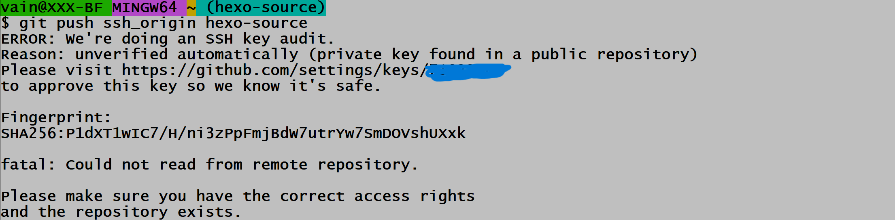

# git push ssh_origin hexo-source 报错：ERROR: we're doing an SSH key audit.的解决办法

由于Git Bash是命令行交互，所以在出现报错后的回显信息很重要。好多时候，解决方案就在回显信息中。如题，这个报错的解决方案就在回显信息中，如下图所示：

所以这个只需要访问`https://github.com/settings/keys/*****`进行提权即可解决。出现这个问题的原因是因为修改GitHub远程仓库的默认分支，导致SSH_key权限出现了问题。当然这个问题很容易就能解决，不过我们关注的不应该仅仅是报错本身，更应该关注解决问题的方法和思路。
