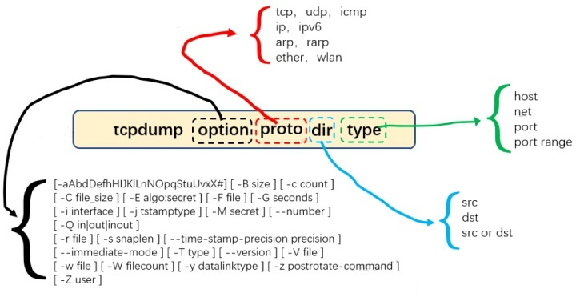
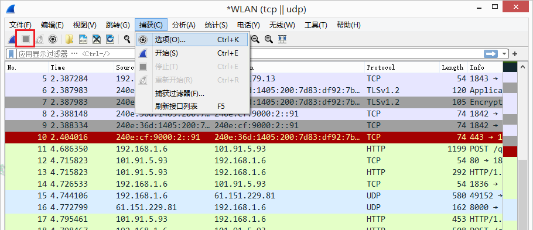
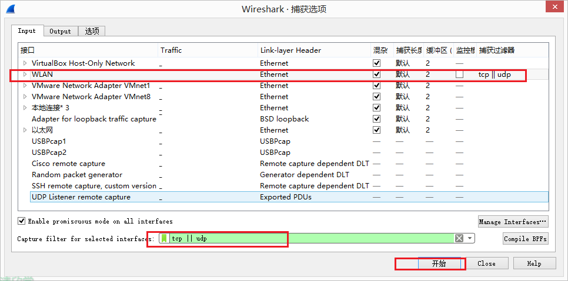
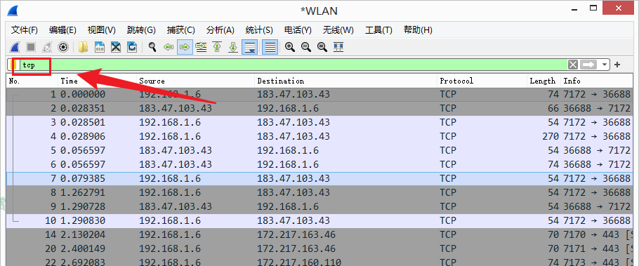

# tcpdump和wireshark工具(网络排障)

## 工具使用及说明

### tcpdump工具的作用及使用方法

- 了解使用tcpdump的场景以及在这些场景中具体的使用方法

### wireshark工具的作用及使用方法

- 了解使用wireshark的场景以及在这些场景中具体的使用方法

---

### 网络抓包说明

**为什么要抓包？**

- 定位网络接口问题
- 分析其他app数据接口
- 学习网络协议，使用抓包工具分析网络数据更直观

**抓包的原理是什么？**

要实现对app的网络数据抓包，需要监控app与服务器交互之间的网络节点，监控其中任意一个网络节点(网卡)，获取所有经过网卡中的数据，对这些数据按照网络协议进行解析，这就是抓包的基本原理。

但是中间网络节点，不受我们控制，所以基本无法实现抓包的，只能在客户端和服务端进行抓包。

**混杂模式**

混杂模式就是指网卡能接受所有通过它的数据流，不管什么格式，什么地址的，这样网口所有数据包都可以交给应用层处理。正常情况下，设备只接受发给自己或广播地址。其它的地址在底层被转发或丢弃，这样数据不会交给应用层处理。

### 抓包工具说明

- fidder：Windows平台最受欢迎的抓包工具，免费易用
- charles：Mac平台最佳抓包工具，易用，收费但可一直试用
- wireshark：老牌抓包工具，跨平台，功能齐全、强大
- tcpdump：命令行程序，适用于手机系统和后台系统

| 抓包工具  | 跨平台 | 免费       | 仅支持HTTP(S) | 是否易用 | 界面操作 |
| --------- | ------ | ---------- | ------------- | -------- | -------- |
| fidder    | 是     | 是         | 是            | 是       | 是       |
| charles   | 是     | 否(可试用) | 是            | 是       | 是       |
| wireshark | 是     | 是         | 否            | 否       | 是       |
| tcpdump   | 是     | 是         | 否            | 否       | 否       |

## tcpdump的简介

tcpdump(dump the traffic on a network)命令是基于unix系统的命令行的数据报嗅探工具，可以抓取流动在网卡上的数据包。

### 查看本地网卡状态

```bash
[root@localhost ~]# netstat -i
Kernel Interface table
Iface      MTU    RX-OK RX-ERR RX-DRP RX-OVR    TX-OK TX-ERR TX-DRP TX-OVR Flg
eth0      1500       93      0      0 0           106      0      0      0 BMRU
lo       65536        8      0      0 0             8      0      0      0 LRU
# Iface：存在的网卡;
# MTU：最大传输单元;
# RX-OK RX-ERR RX-DRP RX-OVR：正确接收数据报的数量以及发生错误、流式、碰撞的总数;
# TX-OK TX-ERR TX-DRP TX-OVR：正确发送数据报的数量以及发生错误、流式、碰撞的总数。
```

```bash
tcpdump + 参数 + 表达式
tcpdump [-adeflnNOpqStvx][-c<数据包数量>][-dd][-ddd][-F<表达文件>][-i<网络接口>][-r<数据包文件>]
		[-s<数据包大小>][-tt][-T<数据包类型>][-vv][-w<数据包文件>][表达式]
```

### tcpdump命令格式



## tcpdump的常用选项参数

- **-h：查看tcpdump版本信息。**
- **-D：列出可用于抓包的接口。将会列出接口的数值编号和接口名，它们都可以用于"-i"后。**

- **-i：监听指定的网络接口，比如-i eth0，表示对eth0这个网卡进行抓包。**
- **-e：在输出行打印出数据链路层的头部信息。**
- **-c：抓取指定数目的数据包，比如-c 100表示我要抓取100个满足条件的包。**
- **-n：不对具体ip地址进行域名解析，直接显示ip地址。**
- **-nn：不对具体ip进行域名解析，并且端口号也不显示服务的名称，直接显示数字。**
- **-x：把截取的数据包内容以16进制打印出来。**
- **-X：把截取的数据包内容以ASCII文本形式打印出来。**
- **-s：截取指定大小的数据包，s0表示完整的数据包。**
- **-w：将抓包内容保存到指定文件，并不打印出来。**
- -a：把网络地址和广播地址转换成名称。
- **-t：在输出的每一行不打印时间戳。**
- **-v：输出一个稍微详细的信息，如在IP包中包含TTL和服务类型的信息。**
- **-vv：输出详细的报文信息。**
- -F：从指定的文件中读取表达式，忽略其他表达式。
- **-r：从指定的文件中读取包(这些包一般通过-w选项产生)。**

以下这两个参数：可作抓包的时候打印出信息，作为参考，毕竟我们要在wireshark分析

- -XX：输出数据包的头部数据。
- -vvv：打印和分析的时候，产生非常详细的输出。

### tcpdump -h：查看tcpdump版本信息

```bash
[root@localhost ~]# tcpdump --help
tcpdump: invalid option -- '-'
tcpdump version 4.5.1
libpcap version 1.5.3
Usage: tcpdump [-aAbdDefhHIJKlLnNOpqRStuUvxX] [ -B size ] [ -c count ]
                [ -C file_size ] [ -E algo:secret ] [ -F file ] [ -G seconds ]
                [ -i interface ] [ -j tstamptype ] [ -M secret ]
                [ -P in|out|inout ]
                [ -r file ] [ -s snaplen ] [ -T type ] [ -V file ] [ -w file ]
                [ -W filecount ] [ -y datalinktype ] [ -z command ]
                [ -Z user ] [ expression ]
```

### tcpdump -D：列出可用于tcpdump抓取数据包的网卡接口信息

- 获取硬件接口列表信息，看到此列表后，可以决定要在哪个接口上捕获流量。它还告诉你接口是否已启动、正在运行，以及它是否是环回接口。

```bash
[root@localhost ~]# tcpdump -D
1.eth0
2.nflog (Linux netfilter log (NFLOG) interface)
3.nfqueue (Linux netfilter queue (NFQUEUE) interface)
4.usbmon1 (USB bus number 1)
5.usbmon2 (USB bus number 2)
6.any (Pseudo-device that captures on all interfaces)
7.lo
-------------------------------------------------------------------------------------------------------------------
eth0 //表示该服务器的第一块网卡，一般我们tcpdump抓包都使用这块网卡来抓取。可能有eth1，eth2等等
nflog //Linux下的网络过滤网卡，一般我们不使用它
nfqueue //Linux网络过滤队列接口，一般不使用它
usbmon1 //USB总线接口，一般不使用它
any //任何网卡接口
lo //指的是该主机的回环地址(127.0.0.1)，一般用来测试网络专用，一般的数据都不通过这块网卡，所以我们用tcpdump抓包的时候也不使用这块网卡。
```

### tcpdump -i：监听指定的网络接口

```bash
[root@localhost ~]# netstat -i
Kernel Interface table
Iface      MTU    RX-OK RX-ERR RX-DRP RX-OVR    TX-OK TX-ERR TX-DRP TX-OVR Flg
eth0      1500      695      0      0 0           472      0      0      0 BMRU
lo       65536        8      0      0 0             8      0      0      0 LRU
[root@localhost ~]# tcpdump -i eth0 host 192.168.32.166 and icmp
tcpdump: verbose output suppressed, use -v or -vv for full protocol decode
listening on eth0, link-type EN10MB (Ethernet), capture size 65535 bytes
06:32:09.460471 IP 192.168.32.1 > 192.168.32.166: ICMP echo request, id 1, seq 7, length 40
06:32:09.460500 IP 192.168.32.166 > 192.168.32.1: ICMP echo reply, id 1, seq 7, length 40
06:32:10.474323 IP 192.168.32.1 > 192.168.32.166: ICMP echo request, id 1, seq 8, length 40
06:32:10.474365 IP 192.168.32.166 > 192.168.32.1: ICMP echo reply, id 1, seq 8, length 40
06:32:11.509028 IP 192.168.32.1 > 192.168.32.166: ICMP echo request, id 1, seq 9, length 40
06:32:11.509073 IP 192.168.32.166 > 192.168.32.1: ICMP echo reply, id 1, seq 9, length 40
06:32:12.540879 IP 192.168.32.1 > 192.168.32.166: ICMP echo request, id 1, seq 10, length 40
06:32:12.540919 IP 192.168.32.166 > 192.168.32.1: ICMP echo reply, id 1, seq 10, length 40
```

### tcpdump -e：在输出行打印出数据链路层的头部信息

```bash
[root@localhost ~]# tcpdump -i eth0 host 192.168.32.166 -c 5 -nn -e
tcpdump: verbose output suppressed, use -v or -vv for full protocol decode
listening on eth0, link-type EN10MB (Ethernet), capture size 65535 bytes
22:52:24.460136 00:0c:29:aa:f1:db > 00:50:56:c0:00:08, ethertype IPv4 (0x0800), length 262: 192.168.32.166.22 > 192.168.32.1.14358: Flags [P.], seq 3225709502:3225709698, ack 4145329991, win 177, options [nop,nop,TS val 289241 ecr 6998988], length 196
22:52:24.460359 00:50:56:c0:00:08 > 00:0c:29:aa:f1:db, ethertype IPv4 (0x0800), length 66: 192.168.32.1.14358 > 192.168.32.166.22: Flags [.], ack 196, win 258, options [nop,nop,TS val 6998988 ecr 289237], length 0
22:52:25.769017 00:50:56:c0:00:08 > 00:0c:29:aa:f1:db, ethertype ARP (0x0806), length 60: Request who-has 192.168.32.166 (00:0c:29:aa:f1:db) tell 192.168.32.1, length 46
22:52:25.769047 00:0c:29:aa:f1:db > 00:50:56:c0:00:08, ethertype ARP (0x0806), length 42: Reply 192.168.32.166 is-at 00:0c:29:aa:f1:db, length 28
22:52:25.769849 00:0c:29:aa:f1:db > 00:50:56:c0:00:08, ethertype IPv4 (0x0800), length 582: 192.168.32.166.22 > 192.168.32.1.14358: Flags [P.], seq 196:712, ack 1, win 177, options [nop,nop,TS val 290551 ecr 6998988], length 516
5 packets captured
6 packets received by filter
0 packets dropped by kernel
```

### tcpdump -c：截取指定数量的数据包

```bash
[root@localhost ~]# tcpdump -i eth0 host 192.168.32.166 -c 5
tcpdump: verbose output suppressed, use -v or -vv for full protocol decode
listening on eth0, link-type EN10MB (Ethernet), capture size 65535 bytes
06:34:39.880221 IP 192.168.32.166.ssh > 192.168.32.1.5480: Flags [P.], seq 3181057663:3181057859, ack 3391998684, win 177, options [nop,nop,TS val 403332 ecr 1132356], length 196
06:34:39.880575 IP 192.168.32.1.5480 > 192.168.32.166.ssh: Flags [.], ack 196, win 256, options [nop,nop,TS val 1132358 ecr 403322], length 0
06:34:40.883095 IP 192.168.32.166.35632 > public1.114dns.com.domain: 56985+ PTR? 1.32.168.192.in-addr.arpa. (43)
06:34:40.905708 IP public1.114dns.com.domain > 192.168.32.166.35632: 56985 NXDomain 0/1/0 (120)
06:34:40.906099 IP 192.168.32.166.57403 > public1.114dns.com.domain: 47864+ PTR? 166.32.168.192.in-addr.arpa. (45)
5 packets captured
15 packets received by filter
0 packets dropped by kernel	
```

### tcpdump -n：不进行网络地址的转换 && tcpdump -nn：不进行网络地址及端口的转换

```bash
[root@localhost ~]# tcpdump -i eth0 host 192.168.32.166 -c 4 -n
tcpdump: verbose output suppressed, use -v or -vv for full protocol decode
listening on eth0, link-type EN10MB (Ethernet), capture size 65535 bytes
06:47:16.333392 IP 192.168.32.166.ssh > 192.168.32.1.5480: Flags [P.], seq 3181074491:3181074687, ack 3392003180, win 177, options [nop,nop,TS val 1159785 ecr 1208001], length 196
06:47:16.333749 IP 192.168.32.1.5480 > 192.168.32.166.ssh: Flags [.], ack 196, win 254, options [nop,nop,TS val 1208002 ecr 1159775], length 0
06:47:17.334385 IP 192.168.32.166.ssh > 192.168.32.1.5480: Flags [P.], seq 196:568, ack 1, win 177, options [nop,nop,TS val 1160786 ecr 1208002], length 372
06:47:17.386151 IP 192.168.32.1.5480 > 192.168.32.166.ssh: Flags [.], ack 568, win 260, options [nop,nop,TS val 1208107 ecr 1160786], length 0
4 packets captured
4 packets received by filter
0 packets dropped by kernel
[root@localhost ~]# tcpdump -i eth0 host 192.168.32.166 -c 4 -nn
tcpdump: verbose output suppressed, use -v or -vv for full protocol decode
listening on eth0, link-type EN10MB (Ethernet), capture size 65535 bytes
06:47:25.626276 IP 192.168.32.166.22 > 192.168.32.1.5480: Flags [P.], seq 3181075683:3181075879, ack 3392003304, win 177, options [nop,nop,TS val 1169078 ecr 1208931], length 196
06:47:25.626618 IP 192.168.32.1.5480 > 192.168.32.166.22: Flags [.], ack 196, win 256, options [nop,nop,TS val 1208931 ecr 1169073], length 0
06:47:26.628365 IP 192.168.32.166.22 > 192.168.32.1.5480: Flags [P.], seq 196:568, ack 1, win 177, options [nop,nop,TS val 1170081 ecr 1208931], length 372
06:47:26.680848 IP 192.168.32.1.5480 > 192.168.32.166.22: Flags [.], ack 568, win 255, options [nop,nop,TS val 1209037 ecr 1170081], length 0
4 packets captured
4 packets received by filter
0 packets dropped by kernel
```

### tcpdump -s：截取指定大小的数据包

为了分析数据包的内容，可以通过-s选项改变截取数据包的大小；-s0表示完整数据包(-X：表示以ASCII文本形式显示)

```bash
[root@localhost ~]# tcpdump -i eth0 host 192.168.32.166 -c 2 -nn -X -s 200
tcpdump: verbose output suppressed, use -v or -vv for full protocol decode
listening on eth0, link-type EN10MB (Ethernet), capture size 200 bytes
06:52:35.539512 IP 192.168.32.166.22 > 192.168.32.1.5480: Flags [P.], seq 3181095687:3181095883, ack 3392006452, win 177, options [nop,nop,TS val 1478992 ecr 1239922], length 196
        0x0000:  4510 00f8 6ed0 4000 4006 0928 c0a8 20a6  E...n.@.@..(....
        0x0010:  c0a8 2001 0016 1568 bd9b ab07 ca2d e934  .......h.....-.4
        0x0020:  8018 00b1 c2e2 0000 0101 080a 0016 9150  ...............P
        0x0030:  0012 eb72 0000 00b0 c549 dc8d cfef 1004  ...r.....I......
        0x0040:  5a19 8d68 a66a 3d6b 8dd2 aca2 4a03 4bc6  Z..h.j=k....J.K.
        0x0050:  3a2b e22f 85d8 b5c5 dea5 bc9b 9f64 b57e  :+./.........d.~
        0x0060:  e369 5f5a d79e d4dd 74a5 abde 6362 ceff  .i_Z....t...cb..
        0x0070:  c24e 6be2 84f4 8399 1bcc 4c83 12b1 3dd7  .Nk.......L...=.
        0x0080:  96a8 9046 b809 f59a 6697 68a9 16a9 a4b6  ...F....f.h.....
        0x0090:  ba32 6226 e565 1535 503c 8225 d63b edad  .2b&.e.5P<.%.;..
        0x00a0:  4576 9670 0d93 181a b795 dfd1 5457 8558  Ev.p........TW.X
        0x00b0:  08ce eecb 3a7d 5918 5f60                 ....:}Y._`
06:52:35.539858 IP 192.168.32.1.5480 > 192.168.32.166.22: Flags [.], ack 196, win 256, options [nop,nop,TS val 1239922 ecr 1478987], length 0
        0x0000:  4500 0034 7faa 4000 4006 f921 c0a8 2001  E..4..@.@..!....
        0x0010:  c0a8 20a6 1568 0016 ca2d e934 bd9b abcb  .....h...-.4....
        0x0020:  8010 0100 0497 0000 0101 080a 0012 eb72  ...............r
        0x0030:  0016 914b                                ...K
2 packets captured
2 packets received by filter
0 packets dropped by kernel
# -x：把截取的数据包内容以16进制打印出来；-X：把截取的数据包内容以ASCII文本形式打印出来。
```

### tcpdump -w：将抓包内容保存到指定文件，并不打印出来

- 将报文抓取后保存为.pcap格式的文件，之后使用wireshark进行查看分析

```bash
[root@localhost ~]# tcpdump -i eth0 host 192.168.32.166 -c 20 -nn -w 0928.pcap
tcpdump: listening on eth0, link-type EN10MB (Ethernet), capture size 65535 bytes
20 packets captured
23 packets received by filter
0 packets dropped by kernel
[root@localhost ~]# 
[root@localhost ~]# ls
0928.pcap  anaconda-ks.cfg  cdrom  etc.tar.gz  nohup.out
[root@localhost ~]# sz 0928.pcap 
# 可以通过sz scp或者sftp工具传输0928.pcap报文到本地wireshark进行分析
```

### tcpdump -a：把网络地址和广播地址转换成名称

```bash
[root@localhost ~]# tcpdump -i eth0 host 192.168.32.166 -c 5 -nn -a
tcpdump: verbose output suppressed, use -v or -vv for full protocol decode
listening on eth0, link-type EN10MB (Ethernet), capture size 65535 bytes
04:57:01.119940 IP 192.168.32.166.22 > 192.168.32.1.9418: Flags [P.], seq 1111385826:1111386022, ack 139811203, win 177, options [nop,nop,TS val 5771439 ecr 9186614], length 196
04:57:01.120193 IP 192.168.32.1.9418 > 192.168.32.166.22: Flags [.], ack 196, win 256, options [nop,nop,TS val 9186615 ecr 5771435], length 0
04:57:02.122194 IP 192.168.32.166.22 > 192.168.32.1.9418: Flags [P.], seq 196:552, ack 1, win 177, options [nop,nop,TS val 5772442 ecr 9186615], length 356
04:57:02.172609 IP 192.168.32.1.9418 > 192.168.32.166.22: Flags [.], ack 552, win 255, options [nop,nop,TS val 9186720 ecr 5772442], length 0
04:57:04.124794 IP 192.168.32.166.22 > 192.168.32.1.9418: Flags [P.], seq 552:892, ack 1, win 177, options [nop,nop,TS val 5774445 ecr 9186720], length 340
5 packets captured
6 packets received by filter
0 packets dropped by kernel
```

### tcpdump -t：在输出的每一行不打印时间戳

```bash
[root@localhost ~]# tcpdump -i eth0 host 192.168.32.166 -c 4 -nn -t
tcpdump: verbose output suppressed, use -v or -vv for full protocol decode
listening on eth0, link-type EN10MB (Ethernet), capture size 65535 bytes
IP 192.168.32.166.22 > 192.168.32.1.9418: Flags [P.], seq 1111389102:1111389298, ack 139812027, win 177, options [nop,nop,TS val 5884220 ecr 9197891], length 196
IP 192.168.32.1.9418 > 192.168.32.166.22: Flags [.], ack 196, win 255, options [nop,nop,TS val 9197891 ecr 5884214], length 0
IP 192.168.32.166.22 > 192.168.32.1.9418: Flags [P.], seq 196:520, ack 1, win 177, options [nop,nop,TS val 5885221 ecr 9197891], length 324
IP 192.168.32.1.9418 > 192.168.32.166.22: Flags [.], ack 520, win 254, options [nop,nop,TS val 9197997 ecr 5885221], length 0
4 packets captured
4 packets received by filter
0 packets dropped by kernel	
```

### tcpdump -v：输出一个稍微详细的信息，如在IP包中包含TTL和服务类型的信息

```bash
[root@localhost ~]# tcpdump -i eth0 host 192.168.32.166 -c 4 -nn -t -v
tcpdump: listening on eth0, link-type EN10MB (Ethernet), capture size 65535 bytes
IP (tos 0x10, ttl 64, id 6098, offset 0, flags [DF], proto TCP (6), length 184)
    192.168.32.166.22 > 192.168.32.1.9418: Flags [P.], cksum 0xc2a2 (incorrect -> 0x4859), seq 1111390402:1111390534, ack 139812259, win 177, options [nop,nop,TS val 5976100 ecr 9207078], length 132
IP (tos 0x0, ttl 64, id 28652, offset 0, flags [DF], proto TCP (6), length 52)
    192.168.32.1.9418 > 192.168.32.166.22: Flags [.], cksum 0xbf38 (correct), ack 132, win 258, options [nop,nop,TS val 9207078 ecr 5976096], length 0
IP (tos 0x10, ttl 64, id 6099, offset 0, flags [DF], proto TCP (6), length 600)
    192.168.32.166.22 > 192.168.32.1.9418: Flags [P.], cksum 0xc442 (incorrect -> 0x045c), seq 132:680, ack 1, win 177, options [nop,nop,TS val 5977101 ecr 9207078], length 548
IP (tos 0x0, ttl 64, id 28653, offset 0, flags [DF], proto TCP (6), length 52)
    192.168.32.1.9418 > 192.168.32.166.22: Flags [.], cksum 0xb8c0 (correct), ack 680, win 256, options [nop,nop,TS val 9207183 ecr 5977101], length 0
4 packets captured
4 packets received by filter
0 packets dropped by kernel
```

### tcpdump -vv：输出详细的报文信息

```bash
[root@localhost ~]# tcpdump -i eth0 host 192.168.32.166 -c 4 -nn -t -vv
tcpdump: listening on eth0, link-type EN10MB (Ethernet), capture size 65535 bytes
IP (tos 0x10, ttl 64, id 6104, offset 0, flags [DF], proto TCP (6), length 184)
    192.168.32.166.22 > 192.168.32.1.9418: Flags [P.], cksum 0xc2a2 (incorrect -> 0x1688), seq 1111391898:1111392030, ack 139812383, win 177, options [nop,nop,TS val 6036304 ecr 9213100], length 132
IP (tos 0x0, ttl 64, id 28660, offset 0, flags [DF], proto TCP (6), length 52)
    192.168.32.1.9418 > 192.168.32.166.22: Flags [.], cksum 0xb631 (correct), seq 1, ack 132, win 259, options [nop,nop,TS val 9213101 ecr 6036298], length 0
IP (tos 0x10, ttl 64, id 6105, offset 0, flags [DF], proto TCP (6), length 616)
    192.168.32.166.22 > 192.168.32.1.9418: Flags [P.], cksum 0xc452 (incorrect -> 0x4c01), seq 132:696, ack 1, win 177, options [nop,nop,TS val 6037306 ecr 9213101], length 564
IP (tos 0x0, ttl 64, id 28661, offset 0, flags [DF], proto TCP (6), length 52)
    192.168.32.1.9418 > 192.168.32.166.22: Flags [.], cksum 0xafa7 (correct), seq 1, ack 696, win 256, options [nop,nop,TS val 9213206 ecr 6037306], length 0
4 packets captured
4 packets received by filter
0 packets dropped by kernel
```

### tcpdump -r：从指定的文件中读取包(这些包一般通过-w选项产生)

```bash
[root@localhost ~]# ls
0928.pcap  anaconda-ks.cfg  cdrom  etc.tar.gz  nohup.out
[root@localhost ~]# tcpdump -i eth0 host 192.168.32.166 -c 4 -nn -r 0928.pcap 
reading from file 0928.pcap, link-type EN10MB (Ethernet)
22:45:40.204635 IP 192.168.32.166.22 > 192.168.32.1.14358: Flags [P.], seq 3225700090:3225700222, ack 4145327419, win 177, options [nop,nop,TS val 4294852282 ecr 6958562], length 132
22:45:40.204851 IP 192.168.32.1.14358 > 192.168.32.166.22: Flags [.], ack 132, win 260, options [nop,nop,TS val 6958564 ecr 4294852264], length 0
22:45:54.659141 IP 192.168.32.166.123 > 162.159.200.1.123: NTPv3, Client, length 48
22:45:55.920286 IP 192.168.32.166.123 > 162.159.200.123.123: NTPv3, Client, length 48
[root@localhost ~]# 
```

### tcpdump -q：快速输出，仅列出少数的传输协议信息

```bash
[root@localhost ~]# tcpdump -i eth0 host 192.168.32.166 -c 4 -nn -q
tcpdump: verbose output suppressed, use -v or -vv for full protocol decode
listening on eth0, link-type EN10MB (Ethernet), capture size 65535 bytes
05:13:31.753240 IP 192.168.32.166.22 > 192.168.32.1.9418: tcp 196
05:13:31.753450 IP 192.168.32.1.9418 > 192.168.32.166.22: tcp 0
05:13:32.754991 IP 192.168.32.166.22 > 192.168.32.1.9418: tcp 180
05:13:32.805703 IP 192.168.32.1.9418 > 192.168.32.166.22: tcp 0
4 packets captured
4 packets received by filter
0 packets dropped by kernel
```

### tcpdump -p：不让网络界面进入混杂模式

```bash
[root@localhost ~]# tcpdump -i eth0 host 192.168.32.166 -c 4 -nn -p
tcpdump: verbose output suppressed, use -v or -vv for full protocol decode
listening on eth0, link-type EN10MB (Ethernet), capture size 65535 bytes
05:14:59.146874 IP 192.168.32.166.22 > 192.168.32.1.9418: Flags [P.], seq 1111423886:1111424082, ack 139816387, win 177, options [nop,nop,TS val 6849467 ecr 9294417], length 196
05:14:59.147090 IP 192.168.32.1.9418 > 192.168.32.166.22: Flags [.], ack 196, win 255, options [nop,nop,TS val 9294418 ecr 6849464], length 0
05:15:00.148070 IP 192.168.32.166.22 > 192.168.32.1.9418: Flags [P.], seq 196:552, ack 1, win 177, options [nop,nop,TS val 6850468 ecr 9294418], length 356
05:15:00.199906 IP 192.168.32.1.9418 > 192.168.32.166.22: Flags [.], ack 552, win 260, options [nop,nop,TS val 9294523 ecr 6850468], length 0
4 packets captured
4 packets received by filter
0 packets dropped by kernel
```

### tcpdump -T：将监听到的包直接解释为指定的类型的报文

- 常见的类型有**rpc**(远程过程调用)和**snmp**(简单网络管理协议)

```bash
[root@localhost ~]# tcpdump -i eth0 host 192.168.32.166 -c 4 -nn -T rpc
tcpdump: verbose output suppressed, use -v or -vv for full protocol decode
listening on eth0, link-type EN10MB (Ethernet), capture size 65535 bytes
05:18:57.401450 IP 192.168.32.166.22 > 192.168.32.1.9418: Flags [P.], seq 1111425846:1111426042, ack 139817067, win 177, options [nop,nop,TS val 7087721 ecr 9318242], length 196
05:18:57.401680 IP 192.168.32.1.9418 > 192.168.32.166.22: Flags [.], ack 196, win 260, options [nop,nop,TS val 9318243 ecr 7087716], length 0
05:18:58.410418 IP 192.168.32.166.22 > 192.168.32.1.9418: Flags [P.], seq 196:552, ack 1, win 177, options [nop,nop,TS val 7088730 ecr 9318243], length 356
05:18:58.462108 IP 192.168.32.1.9418 > 192.168.32.166.22: Flags [.], ack 552, win 258, options [nop,nop,TS val 9318349 ecr 7088730], length 0
4 packets captured
4 packets received by filter
0 packets dropped by kernel
```

## tcpdump的常用协议参数(协议关键字)

- 缺省是所有协议的信息包

```bash
传输层协议：tcp、udp、icmp
网络层协议：ip、ipv6
数据链路层协议：arp、rarp、ether、wlan
```

## tcpdump的常用方向参数(方向关键字)

```bash
# 如果没有特殊说明，默认的类型是src or dst
src：ip包的源地址，如：src 10.1.110.110
dst：ip包的目标地址，如：dst 10.1.110.110
src and dst：ip包的源地址和目的地址，如：src and dst 10.1.110.110
src or dst：ip包的源地址或目的地址，如：src and dst 10.1.110.110
```

## tcpdump的常用类型参数(类型关键字)

```bash
# 如果没有特殊说明，默认的类型是host
host：指明一台主机。如：host 10.1.110.110
net：指明一个网络地址，如：net 10.1.0.0/16
port：指明端口号：如：port 8090
port range：指明一组端口号：如 port range 8800-8803
```

## tcpdump的其他类型参数(其他类型关键字)

```bash
gateway、broadcast、less、greater
```

## tcpdump中逻辑运算符和比较运算符的使用

- 逻辑运算符

```bash
非运算：'not'/'!'
与运算：'and'/'&&'
或运算：'or'/'||'
```

- 比较运算符

| 英文写法 | C语言写法 | 含义                     |
| -------- | --------- | ------------------------ |
| eq       | ==        | equal                    |
| ne       | !=        | not equal                |
| gt       | >         | greater than             |
| lt       | <         | less than                |
| ge       | >=        | greater than or equal to |
| le       | <=        | less than or equal to    |

- 注：表达式区分大小写，“udp”不能写成“Udp”，“eq”不能写成“Eq”。

## tcpdump的常见使用

### 抓取指定mac的数据包

- tcpdump -i eth0 -c 4 ether src [mac地址] -nne

```bash
[root@localhost ~]# tcpdump -i eth0 -c 4 ether src 00:0c:29:aa:f1:db -nne
tcpdump: verbose output suppressed, use -v or -vv for full protocol decode
listening on eth0, link-type EN10MB (Ethernet), capture size 65535 bytes
21:00:27.163680 00:0c:29:aa:f1:db > 00:50:56:c0:00:08, ethertype IPv4 (0x0800), length 262: 192.168.32.166.22 > 192.168.32.1.4297: Flags [P.], seq 3818271207:3818271403, ack 131793019, win 177, options [nop,nop,TS val 4294809218 ecr 470878], length 196
21:00:29.165674 00:0c:29:aa:f1:db > 00:50:56:c0:00:08, ethertype IPv4 (0x0800), length 358: 192.168.32.166.22 > 192.168.32.1.4297: Flags [P.], seq 196:488, ack 1, win 177, options [nop,nop,TS val 4294811220 ecr 470878], length 292
21:00:30.167267 00:0c:29:aa:f1:db > 00:50:56:c0:00:08, ethertype IPv4 (0x0800), length 342: 192.168.32.166.22 > 192.168.32.1.4297: Flags [P.], seq 488:764, ack 1, win 177, options [nop,nop,TS val 4294812222 ecr 471085], length 276
21:00:31.168938 00:0c:29:aa:f1:db > 00:50:56:c0:00:08, ethertype IPv4 (0x0800), length 342: 192.168.32.166.22 > 192.168.32.1.4297: Flags [P.], seq 764:1040, ack 1, win 177, options [nop,nop,TS val 4294813223 ecr 471184], length 276
4 packets captured
4 packets received by filter
0 packets dropped by kernel
```

### 同时抓取多个地址，其中一个方向的地址为多个

- tcpdump -i eth0 host 192.168.32.166 and host '(8.8.8.8 or 114.114.114.114)' -nne
- ping 114.114.114.114 -c 2 ; ping 8.8.8.8 -c 2

```bash
[root@localhost ~]# tcpdump -i eth0 host 192.168.32.166 and host '(8.8.8.8 or 114.114.114.114)' -nne
tcpdump: verbose output suppressed, use -v or -vv for full protocol decode
listening on eth0, link-type EN10MB (Ethernet), capture size 65535 bytes

21:07:13.201077 00:0c:29:aa:f1:db > 00:50:56:fa:20:ae, ethertype IPv4 (0x0800), length 98: 192.168.32.166 > 114.114.114.114: ICMP echo request, id 2151, seq 3, length 64
21:07:13.217661 00:50:56:fa:20:ae > 00:0c:29:aa:f1:db, ethertype IPv4 (0x0800), length 98: 114.114.114.114 > 192.168.32.166: ICMP echo reply, id 2151, seq 3, length 64
21:07:14.203185 00:0c:29:aa:f1:db > 00:50:56:fa:20:ae, ethertype IPv4 (0x0800), length 98: 192.168.32.166 > 114.114.114.114: ICMP echo request, id 2151, seq 4, length 64
21:07:14.218540 00:50:56:fa:20:ae > 00:0c:29:aa:f1:db, ethertype IPv4 (0x0800), length 98: 114.114.114.114 > 192.168.32.166: ICMP echo reply, id 2151, seq 4, length 64
21:07:16.447637 00:0c:29:aa:f1:db > 00:50:56:fa:20:ae, ethertype IPv4 (0x0800), length 98: 192.168.32.166 > 8.8.8.8: ICMP echo request, id 2152, seq 1, length 64
21:07:16.533656 00:50:56:fa:20:ae > 00:0c:29:aa:f1:db, ethertype IPv4 (0x0800), length 98: 8.8.8.8 > 192.168.32.166: ICMP echo reply, id 2152, seq 1, length 64
21:07:17.449386 00:0c:29:aa:f1:db > 00:50:56:fa:20:ae, ethertype IPv4 (0x0800), length 98: 192.168.32.166 > 8.8.8.8: ICMP echo request, id 2152, seq 2, length 64
21:07:17.530102 00:50:56:fa:20:ae > 00:0c:29:aa:f1:db, ethertype IPv4 (0x0800), length 98: 8.8.8.8 > 192.168.32.166: ICMP echo reply, id 2152, seq 2, length 64
^C
8 packets captured
8 packets received by filter
0 packets dropped by kernel
```

### 抓取指定源地址、目的IP的数据包

- tcpdump -i eth0 src 192.168.32.166 and dst 192.168.32.1 -nn

```bash
[root@localhost ~]# tcpdump -i eth0 src 192.168.32.166 and dst 192.168.32.1 -nn
tcpdump: verbose output suppressed, use -v or -vv for full protocol decode
listening on eth0, link-type EN10MB (Ethernet), capture size 65535 bytes
21:14:27.905402 IP 192.168.32.166.22 > 192.168.32.1.4297: Flags [P.], seq 3818303571:3818303767, ack 131804491, win 217, options [nop,nop,TS val 682664 ecr 554951], length 196
21:14:28.906741 IP 192.168.32.166.22 > 192.168.32.1.4297: Flags [P.], seq 196:408, ack 1, win 217, options [nop,nop,TS val 683665 ecr 554952], length 212
21:14:29.907188 IP 192.168.32.166.22 > 192.168.32.1.4297: Flags [P.], seq 408:604, ack 1, win 217, options [nop,nop,TS val 684666 ecr 555057], length 196
21:14:31.910530 IP 192.168.32.166.22 > 192.168.32.1.4297: Flags [P.], seq 604:800, ack 1, win 217, options [nop,nop,TS val 686669 ecr 555157], length 196
^C
4 packets captured
5 packets received by filter
0 packets dropped by kernel
```

### 抓取排除某地址或端口的数据包

- 正常表达式加一个not即可
- tcpdump -i eth0 host 192.168.32.166 and not port 22 -nn -c 3

```bash
[root@localhost ~]# tcpdump -i eth0 host 192.168.32.166 and not port 22 -nn -c 3
tcpdump: verbose output suppressed, use -v or -vv for full protocol decode
listening on eth0, link-type EN10MB (Ethernet), capture size 65535 bytes
21:16:16.665783 IP 192.168.32.166.123 > 193.182.111.141.123: NTPv3, Client, length 48
21:16:22.540988 ARP, Request who-has 192.168.32.166 (00:0c:29:aa:f1:db) tell 192.168.32.1, length 46
21:16:22.541024 ARP, Reply 192.168.32.166 is-at 00:0c:29:aa:f1:db, length 28
3 packets captured
3 packets received by filter
0 packets dropped by kernel
```

### 抓取指定tcp标识位的数据包

tcp包里有个flags字段表示包的类型，tcpdump可以根据该字段抓取相应类型的包：tcp[13]就是tcp flags(URG,ACK,PSH,RST,SYN,FIN)，按照这个计算标志位置位后的数值，只有FIN置位为1，ACK+SYN置位就是18。

- 抓取FIN包：tcpdump -i any 'tcp[13] & 1 != 0' -s0
- 抓取SYN+FIN包：tcpdump -i any -p tcp 'tcp[13] & 3 != 0' -s0
- 抓取RST包：tcpdump -i any port 9001 and 'tcp[13] & 4 != 0' -s0

### 抓取带vlan的数据包

- tcpdump -i eth0 vlan and host 192.168.32.166 -c 3 -nn

## wireshark的简介

Wireshark是使用最广泛的一款「开源抓包软件」，常用来检测网络问题、攻击溯源、或者分析底层通信机制。它使用WinPCAP作为接口，直接与网卡进行数据报文交换。

Wireshark使用的环境大致分为两种，一种是电脑直连互联网的单机环境，另外一种就是应用比较多的互联网环境，也就是连接交换机的情况。

「单机情况」下，Wireshark直接抓取本机网卡的网络流量；
「交换机情况」下，Wireshark通过端口镜像、ARP欺骗等方式获取局域网中的网络流量。

- 端口镜像：利用交换机的接口，将局域网的网络流量转发到指定电脑的网卡上。
- ARP欺骗：交换机根据MAC地址转发数据，伪装其他终端的MAC地址，从而获取局域网的网络流量。

## wireshark中过滤器的使用

过滤器是Wireshark的核心功能，也是我们平时使用最多的一个功能。

Wireshark提供了两个过滤器：抓包过滤器 和 显示过滤器。两个过滤器的过滤思路不同。

1. 抓包过滤器：重点在动作，需要的包我才抓，不需要的我就不抓。
2. 显示过滤器：重点在数据的展示，包已经抓了，只是不显示出来。

### 1. 抓包过滤器

抓包过滤器在抓包前使用，它的过滤有一个基本的语法格式：BPF语法格式。

#### 1）BPF语法

BPF（全称 Berkeley Packet Filter），中文叫伯克利封包过滤器，它有四个核心元素：类型、方向、协议 和 逻辑运算符。

1. 类型Type：主机（host）、网段（net）、端口（port）
2. 方向Dir：源地址（src）、目标地址（dst）
3. 协议Proto：各种网络协议，比如：tcp、udp、http
4. 逻辑运算符：与（ && ）、或（ || ）、非（ ！）

四个元素可以自由组合，比如：

- src host 192.168.31.1：抓取源IP为 192.168.31.1 的数据包
- tcp || udp：抓取 TCP 或者 UDP 协议的数据包

#### 2）使用方式

使用抓包过滤器时，需要先停止抓包，设置完过滤规则后，再开始抓包。

停止抓包的前提下，点击工具栏的捕获按钮，点击选项。



在弹出的捕获选项界面，最下方的输入框中输入过滤语句，点击开始即可抓包。



提示：抓包过滤器的输入框，会自动检测语法，绿色代表语法正确，红色代表语法错误。

### 2. 显示过滤器

显示过滤器在抓包后或者抓包的过程中使用。

#### 1）语法结构

显示过滤器的语法包含5个核心元素：IP、端口、协议、比较运算符和逻辑运算符。

1. IP地址：ip.addr、ip.src、ip.dst
2. 端口：tcp.port、tcp.srcport、tcp.dstport
3. 协议：tcp、udp、http
4. 比较运算符：> < == >= <= !=
5. 逻辑运算符：and、or、not、xor（有且仅有一个条件被满足）

5个核心元素可以自由组合，比如：

- ip.addr == 192.168.32.121：显示IP地址为 192.168.32.121 的数据包
- tcp.port == 80 ：显示端口为 80 的数据包

#### 2）使用方式

在过滤栏输入过滤语句，修改后立即生效。



提示：过滤栏有自动纠错功能，绿色表示语法正确，红色表示语法错误。

## wireshark的常见使用

### 显示过滤器的常见使用

- 显示snmp或dns或icmp包

```bash
snmp || dns || icmp
```

- 显示来源或目的ip地址为192.168.32.166的包

```bash
ip.add == 192.168.32.166
```

- 显示来源不为192.168.32.1或者目的不为192.168.32.166的包

```bash
ip.src != 192.168.32.1 or ip.dst != 192.168.32.166
```

- 显示来源不为192.168.32.1并且目的不为192.168.32.166的包

```bash
ip.src != 192.168.32.1 and ip.dst != 192.168.32.166
```

- 显示来源或目的的udp端口号为5668的包

```bash
udp.port eq 5668
```

- 显示目的tcp端口号为25的包

```bash
tcp.dstport == 25
```

- 显示带有tcp标志的包

```bash
tcp.flags
```

- 显示带有tcp SYN标志的包

```bash
tcp.flags.syn eq 0x02
```

### 抓包过滤器的常见使用

- 只捕获某主机的所有流量

```bash
host 192.168.32.166 #捕获源目主机均为192.168.32.166
src 192.168.32.166 #捕获源主机均为192.168.32.166
dst 192.168.32.166 #捕获目主机均为192.168.32.166
net 192.168.32.0/24 #捕获网段为192.168.32.0的所有主机的所有流量
```

- 只捕获特定端口的流量

```bash
tcp portrange 8000-9000 and port 80 #捕获tcp协议端口8000-900和80端口的流量
port 5060 #捕获sip流量，因为sip的默认端口为5060，举一反三：port 22 #捕获的是ssh流量
```

- 捕获vlan的流量
  - 捕获命令中带有vlan字段，可以捕获接口上有vlan标签的数据包，具体使用方法：

```bash
vlan and (host 192.168.32.166 and port 80) #捕获vlan中主机192.168.32.166，前提是有vlan，在WiFi中不一定可以捕获到相应的流量，局域网（二层环境中vlan标签很常见）
```

- 只(不)捕获arp流量

```bash
host 192.168.32.166 and arp # 只捕获主机为192.168.32.166的arp流量
host 192.168.32.166 and !arp # 只捕获除主机为192.168.32.166以外流量中的arp流量
arp #捕获接口中的所有arp请求
!arp  #捕获接口中的所有非arp请求
```

- 只捕获某主机的dns流量

```bash
host 192.168.32.166 and port 53 # 只捕获主机为192.168.32.166的dns流量
src 192.168.32.166 and port 53 # 只捕获主机192.168.32.166对外的dns流量
dst 192.168.32.166 and port 53 # 只捕获主机192.168.32.166的dns流量
port 53 # 捕获接口中的所有主机的dns流量
```

- 只(不)捕获某主机的http流量

```bash
host 192.168.32.166 and port 80 and http # 只捕获主机为192.168.32.166的http流量，注意如果http端口为8080，需要将80改为8080
port 80 and http # 捕获所有经过该接口的http流量，同样如果http端口为8080，需要将80改为8080
not port 80 # 捕获除http以外的所有流量，同样如果http端口为8080，需要将80改为8080
not port 80 and http # 捕获除http以外的所有流量，同样如果http端口为8080，需要将80改为8080
```

## wireshark使用时的注意事项

局域网的所有流量都会发送给我们的电脑，默认情况下，我们的电脑只会对自己mac的流量进行解包，而丢弃其他mac的数据包。
开启混杂模式后，我们就可以解析其他mac的数据包，因此，我们使用Wireshark时，通常都会开启混杂模式。

点击菜单栏的「捕获」按钮，点击「选项」，勾选「在所有接口上使用混杂模式」。


