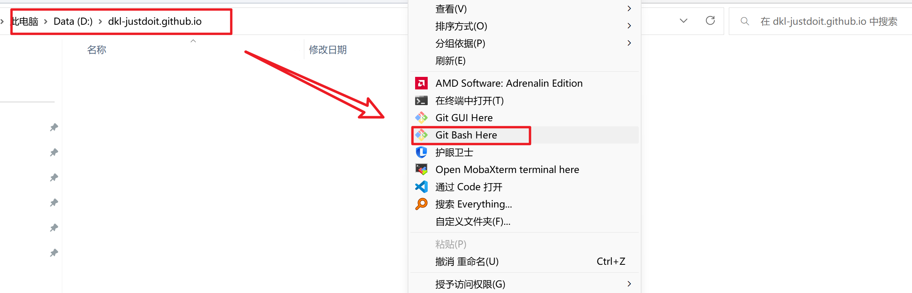

# HEXO 博客多端同步问题

搭完博客，想在不同电脑上更新博客就会出现博客内容不同步的问题，而且到处拷贝文件费时费力，因此就把博客源码放到GitHub，通过Git工具进行多终端的同步。

前提条件：1、首先完成git和node的安装以及环境搭建。2、使用npm工具`全局安装hexo-cli`。

## 1. 通过 git 工具实现 HEXO 博客源文件同步

在博客根目录执行，`思考如下`：由于将博客源码都上传到Github的hexo-source分支。

- 第一种思路：如果能够直接克隆远程库指定分支，直接克隆就能将博客源文件同步到本地库，完成博客更新后提交所有文件到远端仓库即可。
- 第二种思路：搭建一个与其他电脑上一样的环境也能实现，然后拉取远程仓库指定分支到本地库，同样地，完成博客更新后提交所有文件到远端仓库即可。

### 1.1 第一种思路实现过程

1. 先使用npm工具全局安装hexo-cli，最好使用cmd(管理员)执行该命令

 ```bash
npm install hexo-cli -g  # 先使用npm工具全局安装hexo-cli，最好使用cmd(管理员)执行该命令
 ```

2. 使用Git clone命令进行博客源文件的同步，具体如下：

```bash
  git clone git@github.com:dkl-justdoit/dkl-justdoit.github.io.git # 默认情况下，git clone会将远程仓库的默认分支上的文件拉取到本地仓库
  git clone -b hexo-source git@github.com:dkl-justdoit/dkl-justdoit.github.io.git # 通过-b参数可以自行指定要拉取远程库的哪个分支；通过这种方式在本地创建该分支的文件夹，且只包含该远程仓库的该分支下所有文件，其他分支文件不会包含；而且克隆后本地只有这一个分支。
  ##############################################################################################################
  在每次写完文章并完成博客更新后，还要将所有博客源文件推送到远端仓库，在dkl-justdoit.github.io目录下操作如下：
  git add . 			 # 所有变化提交到暂存区
  git commit -m "新发布xxx文章，已同步"  # 提交文件，-m可添加注释信息
  git push ssh_origin hexo-source   # 推送博客源文件到hexo-source分支
```

### 1.2 第二种思路实现过程

1. 先使用npm工具全局安装hexo-cli，最好使用cmd(管理员)执行该命令

```bash
  npm install hexo-cli -g  # 先使用npm工具全局安装hexo-cli，最好使用cmd(管理员)执行该命令
```

2. 在D盘下新建一个文件夹，名为dkl-justdoit.github.io。



3. 进入dkl-justdoit.github.io文件夹，右键打开Git Bash，初始化后依次进行如下操作。

```bash
  git init   # git初始化
  git remote add ssh_origin git@github.com:dkl-justdoit/dkl-justdoit.github.io.git  # 添加远程仓库，注意这里要添加你自己的仓库
  git fetch ssh_origin hexo-source # hexo-source为远程仓库想要拉取分支的分支名(如果是默认main就无需这么麻烦，直接git clone即可)；把远程分支拉取到本地
  git checkout -b hexo-source ssh_origin/hexo-source # 在本地新建hexo-source分支并切换到该分支，且将本地新建的该分支与远程库中的hexo-source分支关联起来
  git pull ssh_origin hexo-source(远程库分支名) # 把远程分支上的内容拉取到本地
  ##############################################################################################################
  上面的过程可以简化，具体如下：
  git init   # git初始化
  git remote add ssh_origin git@github.com:dkl-justdoit/dkl-justdoit.github.io.git  # 添加远程仓库，注意这里要添加你自己的仓库
  git pull ssh_origin hexo-source(远程库分支名) # 把远程分支上的内容拉取到本地
  ##############################################################################################################
  在每次写完文章并完成博客更新后，还要将所有博客源文件推送到远端仓库，在dkl-justdoit.github.io目录下操作如下：
  git add . 			 # 所有变化提交到暂存区
  git commit -m "新发布xxx文章，已同步"  # 提交文件，-m可添加注释信息
  git push ssh_origin hexo-source   # 推送博客源文件到hexo-source分支
```

3. 切换到dkl-justdoit.github.io文件夹查看，会发现已经完成了远程分支到本地的拉取，完成博客更新后提交所有文件到远端仓库即可，这样Github上就完成了博客源文件的更新，实现了HEXO博客的多端同步。

## 2. 通过 git submodule 实现 HEXO 第三方主题同步

1. 之前的博客已经通过`git submodule`实现了`fluid/butterfly/volantis`三种主题的同步更新，对于多主体共存，个人理解如下：

```bash
多主题共存，不是将主题推送到 git@github.com:dkl-justdoit/dkl-justdoit.github.io.git ，而是推送到 git@github.com:dkl-justdoit/hexo-theme-fluid.git 、 git@github.com:dkl-justdoit/hexo-theme-butterfly.git 或 git@github.com:dkl-justdoit/hexo-theme-volantis.git 对应的远程仓库。
因此，所有修改过后的主题是保存到对应主题仓库下的[主题名]分支(以fluid为例，是保存到 git@github.com:dkl-justdoit/hexo-theme-fluid.git 仓库的fluid分支上。)所以，针对多主题共存，需要在本地仓库的主题目录中新创建分支，然后再推送到远程库并关联追踪。
```

2. 博客根目录下的.gitmodules文件中保存了远程库项目URL与本地仓库中对应目录的映射关系。
3. 切换到blog目录下，执行如下操作即可完成同步。

```bash
在blog目录下
git submodule update --init --recursive # 拉取子模块并初始化本配置文件
hexo clean # 清除hexo生成html缓存文件
hexo g # 重新生成html缓存文件
hexo d # 将生成的博客html推送到dkl-justdoit.github.io的默认分支(main分支)
hexo s # 开启hexo服务，可以通过localhost:4000来进行博客预览
```

4. 如果第三方主题配置进行了修改，修改完成后需要进行如下操作。

```bash
cd themes/hexo-theme-volantis/ # 进入第三方主题所在目录
git branch volantis   # 创建本地volantis主题分支
git checkout volantis  # 切换到volantis本地主题分支
git add .
git commit -m '剥离主题volantis' # 提交文件，并添加提交的注释信息
git push -u origin volantis # 推送本地volantis主题分支到dkl-justdoit/hexo-theme-volantis.git/volantis，并进行关联追踪
#"git push -u origin volantis"中的-u参数，第一次推送时需要添加，因为要将本地分支与远端仓库的对应分支关联起来，这样就能将修改过的第三方主题推送到自己远端主题仓库的对应分支上，从而实现多端同步。
```
