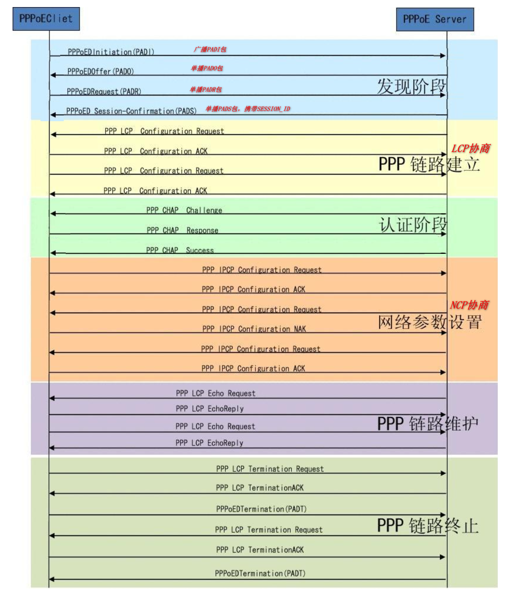

# 基础概念

- 注释
  1. 以太网协议报文格式是基础
  2. 

### 什么是PPPoE

PPPoE（Point-to-Point Protocol over Ethernet）可以称作为以太网上的PPP协议，应用在链路层。它通过在以太网上提供点到点的连接，建立PPP会话，封装PPP报文为PPPoE报文。

# PPPoE拨号认证的背景

### PPPoE解决了哪些问题

PPPoE技术可以将用户连接到远程接入设备上，并提供良好访问控制功能，提供了一种经济的用户接入技术，并实现了对用户的控制。  
PPPoE利用以太网络，提供远程的多个用户主机接入功能，并且能够提供数据传输的计费数据，解决用户上网收费等实际应用问题，因而被广泛应用于接入运营商网络。

# PPP协议报文分析

这个已有

# PPPoE协议报文分析

这个已有

# PPPoE拨号认证流程

# PPPoE和IPoE的区别总结

+ 先获取IP地址 or 先认证
  1. PPPoE：先认证，认证通过后再分配IP地址
  2. IPoE：先通过DHCP拿ip地址，再进行认证
