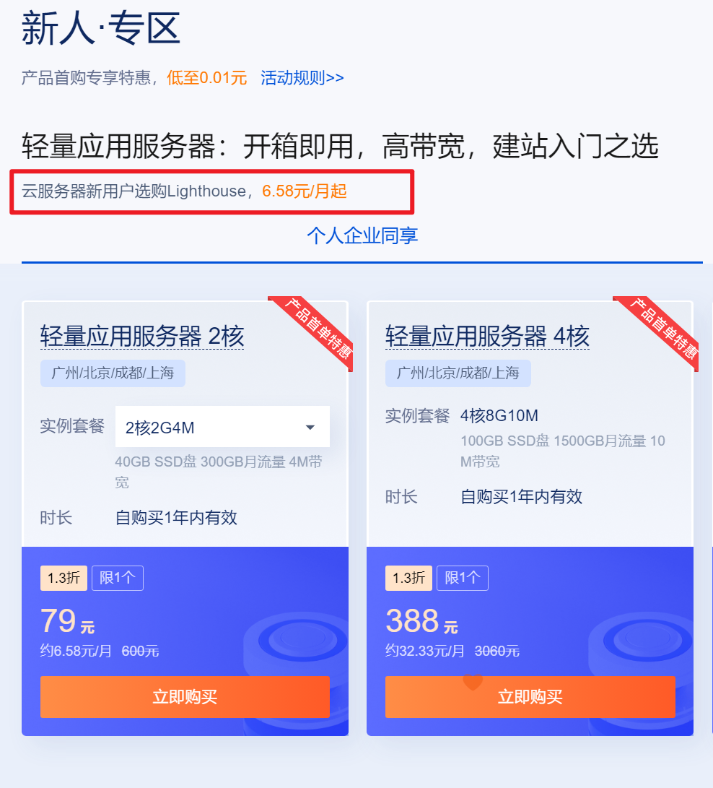

# fluid主题优化记录

### 1. 前言

为了不给以后更新添麻烦，优化过程中尽量不涉及fluid主题源码修改。因此，本文将尽量只通过修改博客配置文件和主题配置文件以及引入各种js和css文件，来美化fluid主题。

### 2. Fluid 页脚增加网站运行时长

首先，需要把`主题配置文件`中的 `footer: content`：

```yaml
footer:
  content: '
    <a href="https://hexo.io" target="_blank" rel="nofollow noopener"><span>Hexo</span></a>
    <i class="iconfont icon-love"></i>
    <a href="https://github.com/fluid-dev/hexo-theme-fluid" target="_blank" rel="nofollow noopener"><span>Fluid</span></a>
  '
```

修改为：

```yaml
footer:
  content: '
    <a href="https://hexo.io" target="_blank" rel="nofollow noopener"><span>Hexo</span></a>
    <i class="iconfont icon-love"></i>
    <a href="https://github.com/fluid-dev/hexo-theme-fluid" target="_blank" rel="nofollow noopener"><span>Fluid</span></a>
    <div style="font-size: 0.85rem">
      <span id="timeDate">载入天数...</span>
      <span id="times">载入时分秒...</span>
      <script src="/assets/js/duration.js"></script>
    </div>
  '
```

其中，`content` 前三行是 Fluid 原有的页脚内容，建议不要删除，可稍作修改，保留 Fluid 的超链接，用于向更多人推广主题。`duration.js` 包含的才是功能代码，我们在博客目录下创建 `source/assets/js/duration.js`，内容如下：

```javascript
!(function() {
  /** 计时起始时间，自行修改 **/
  var start = new Date("2022/06/18 13:00:00");

  function update() {
    var now = new Date();
    now.setTime(now.getTime()+250);
    days = (now - start) / 1000 / 60 / 60 / 24;
    dnum = Math.floor(days);
    hours = (now - start) / 1000 / 60 / 60 - (24 * dnum);
    hnum = Math.floor(hours);
    if(String(hnum).length === 1 ){
      hnum = "0" + hnum;
    }
    minutes = (now - start) / 1000 /60 - (24 * 60 * dnum) - (60 * hnum);
    mnum = Math.floor(minutes);
    if(String(mnum).length === 1 ){
      mnum = "0" + mnum;
    }
    seconds = (now - start) / 1000 - (24 * 60 * 60 * dnum) - (60 * 60 * hnum) - (60 * mnum);
    snum = Math.round(seconds);
    if(String(snum).length === 1 ){
      snum = "0" + snum;
    }
    document.getElementById("timeDate").innerHTML = "本站安全运行&nbsp"+dnum+"&nbsp天";
    document.getElementById("times").innerHTML = hnum + "&nbsp小时&nbsp" + mnum + "&nbsp分&nbsp" + snum + "&nbsp秒";
  }

  update();
  setInterval(update, 1000);
})();
```

其次，不要忘记把上面注释的时间改为自己的时间，至此这项功能就引入到 `<footer>` 里了。

`注意：`assets文件夹是我个人自己创建用来存放优化博客主题的所有类型的文件，如`图片、视频、音频、js、css`等。其中，`js`的路径为：`D:\dkl-justdoit.github.io\source\assets\js`

### 3.浏览器标签图标与博客标题

在`主题配置文件`中查找`favicon`，然后将`favicon`和`apple_touch_icon`对应的`fluid.png`进行替换为自定义的浏览器标签图标即可。

另外，博客页面左上角的博客标题，默认是使用**站点配置**中的 `title`，这个配置同时控制着网页在浏览器标签中的标题，如需单独区别设置，可在**主题配置**中设置：

```yaml
navbar:
  blog_title: 博客标题
修改为：
navbar:
  blog_title: vaincourtship  
```

### 4. 创建关于页

```bash
$ hexo new page about
```

创建成功后修改 `/source/about/index.md`，添加 `layout` 属性。

```yaml
---
layout: "about"
title: about
date: 2022-07-02 21:23:29
banner_img: 
comment: 'twikoo'
---

## 介绍一下自己

我就是我，不一样的烟火！！
```

### 5. 创建留言版(自定义页面)

```bash
$ hexo new page remark
```

创建成功后修改 `/source/remark/index.md`，添加 `layout` 属性。

```bash
---
layout: "remark"
title: 留言板
date: 2022-08-05 13:20:32
banner_img: 
comment: 'twikoo'
---

欢迎留言，请留下邮箱方便我回复您！
```

### 6. 更换头像及社交帐号

在`主题配置文件`中找到`about`，介绍自己的信息，具体如下：

```yaml
#---------------------------
# 关于页
# About Page
#---------------------------
about:
  enable: true
  banner_img: /img/default.png # 关于页的顶部大图
  banner_img_height: 60
  banner_mask_alpha: 0.3
  avatar: /img/avatar.png # 博客头像
  name: "vaincourtship" # 博客名称
  intro: "慢慢来，谁还没有一个努力的过程！" # 自我介绍
  # 更多图标可从 https://hexo.fluid-dev.com/docs/icon/ 查找，`class` 代表图标的 css class，添加 `qrcode` 后，图标不再是链接而是悬浮二维码
  # More icons can be found from https://hexo.fluid-dev.com/docs/en/icon/  `class` is the css class of the icon. If adding `qrcode`, The icon is no longer a link, but a hovering QR code
  icons: # 这里是社交账号选项，可以自定义添加
    - { class: "iconfont icon-github-fill", link: "https://github.com", tip: "GitHub" }
    - { class: "iconfont icon-douban-fill", link: "https://douban.com", tip: "豆瓣" }
    - { class: "iconfont icon-wechat-fill", qrcode: "/assets/img/favicon.png" } # 把微信二维码放到这里
```

其中，banner_img可以保持不变；avatar改为自己的头像；name改为博客名称。当然，还可以增加其他社交账号，具体如下：

```yaml
 icons:
    - { class: "iconfont icon-github-fill", link: "https://github.com/dkl-justdoit", tip: "GitHub" }
    - { class: "iconfont icon-gitee-fill", link: "https://gitee.com/dkl-justdoit", tip: "Gitee" }
    - { class: "iconfont icon-google-fill", link: "https://mail.google.com/mail/u/0/", tip: "Gmail" }
    - { class: "iconfont icon-youtube-fill", link: "https://www.youtube.com/", tip: "YouTube" }
    - { class: "iconfont icon-twitter-fill", link: "https://twitter.com/", tip: "twitter" }
    - { class: "iconfont icon-bilibili-fill", link: "https://space.bilibili.com/361104740", tip: "哔哩哔哩" }
    - { class: "iconfont icon-wechat-fill", qrcode: "/assets/img/favicon.png" }
    - { class: "iconfont icon-weibo-fill", link: "https://weibo.com/u/7209354933", tip: "微博" }
    # - { class: "iconfont icon-link-fill", link: "https://www.cnblogs.com/dkl-justdoit/", tip: "博客园" }
# menu菜单栏开启，这里就不要开启了，两个地方都开启，有些多余
```

### 7. 导航栏菜单

```yaml
menu:
    - { key: "home", link: "/", icon: "iconfont icon-home-fill" }
    - { key: "archive", link: "/archives/", icon: "iconfont icon-archive-fill" }
    - { key: "category", link: "/categories/", icon: "iconfont icon-category-fill" }
    - { key: "tag", link: "/tags/", icon: "iconfont icon-tags-fill" }
    - { key: "留言板", link: "/remark/", icon: 'iconfont icon-cliplist' } # 新增
    - { key: "博客园", link: "https://www.cnblogs.com/dkl-justdoit/", icon: "iconfont icon-link-fill" } # 新增
    - { key: "about", link: "/about/", icon: "iconfont icon-user-fill" }
    - { key: "links", link: "/links/", icon: "iconfont icon-link-fill" } # 启用即可
```

### 8. 页面顶部大图和文章首页图 

在`主题配置文件`中查找`post:`，其中的`banner_img: /img/default.png`决定了每一篇文章页面的默认顶部大图，如果新建文章没有指定`banner_img:`的路径，那默认就是`default.png`这个图。

在`主题配置文件`中查找`index_img`，可以看到关于`index_img`的解释，就是文章在首页的默认封面图，如果指定了就按指定的显示，否则就按默认封面图`default_index_img:`显示，但是默认没有指定。当然，可以通过手动指定封面图片，也可以通过随机图片API的调用来实现。

### 9. 首页文章的随机封面图

如果文章没有指定封面图，可以通过调用随机图片API来实现，API将随机返回一张图片作为封面图，比如与MC酱相关的。

```html
https://api.ixiaowai.cn/mcapi/mcapi.php
```

在主题配置文件中找到`default_index_img:`，然后将链接填入其中。

```yaml
default_index_img: https://api.ixiaowai.cn/mcapi/mcapi.php
```

### 10.  slogan打字机

在`主题配置文件`中查找`slogan:`，更改如下：

```yaml
# 首页副标题的独立设置
  # Independent config of home page subtitle
  slogan:
    enable: true

    # 为空则按 hexo config.subtitle 显示
    # If empty, text based on `subtitle` in hexo config
    text: "慢慢来，谁还没有一个努力的过程！" # 这里更改为想要替换的文字
```

### 11. 文章post模板

博客scaffolds目录下包含三个模板文件，其中draft和post的内容一致，具体如下：

```bash
---
# 页面布局
layout: 
# 文章标题
title: {{ title }}
# 发布时间，如果没有排序字段，会根据事件排序。
date: {{ date }}
# 排序，越大越靠前。
# sticky: 1000
# 最后更新时间
updated: 
# 评论插件
comment: 'twikoo'
# 是否隐藏文章
hide: false
# 标签
tags:
  - 网络
  - Linux
# 分类
categories: 
  - [Linux]
  - [网络]
# 文章摘要
excerpt: 
# 页面顶部大图
banner_img: /assets/img/banner/xxx.jpg
# 文章首页显示图片
index_img: /assets/img/common/xxx.jpg
# 是否启用LaTeX
math: false
---
# 这里要注意的是，如果“文章摘要excerpt: ”有出现但不填写，是会报错的，要么写摘要，要么把“excerpt: ”用“#”注释掉
```

page内容如下：

```bash
---
layout: 
title: {{ title }}
date: {{ date }}
banner_img: 
comment: 'twikoo'
---
```

### 12. 永久链接

Hexo 默认文章链接生成规则是按照年、月、日、标题来生成的。一旦文章标题或者发布时间被修改，URL 就会发生变化，之前文章地址也会变成 404，而且 URL 层级很深，不利于分享和搜索引擎收录。可以借助插件 `hexo-abbrlink`来实现。

安装过程：

```bash
博客根目录下执行：npm install hexo-abbrlink --save
修改博客根目录配置文件_config.yml中的permalink：
# permalink: :year/:month/:day/:title/
# 下面四行是安装插件后自行添加的
permalink: p/:abbrlink.html  # p 是自定义的前缀
abbrlink:
    alg: crc32   #算法： crc16(default) and crc32
    rep: hex     #进制： dec(default) and hex
进行验证：hexo clean && hexo g && hexo s
推送博客到远程仓库：hexo d
```

会发现该插件会在每篇文章的开头增加内容`abbrlink: 39d6ddf6`，这个字符串就是这篇文章的唯一标识，无论修改标题还是发布文章都不会改变。

### 13. js或css的引入过程

1. 新建js或css

以js为例，在themes/hexo-theme-fluid/source/js/diy/文件夹下新建一个timeDateRun.js，找到一段可用的js美化代码，复制粘贴到新建的timeDateRun.js文件中。然后在主题配置文件themes/hexo-theme-fluid/_config.yml中找到"custom_js"和"custom_css"，进行新建js文件和css文件的引入。

2. 将新建的js或css引入主题

```yaml
custom_js:
  - /js/diy/timeDateRun.js # 运行时间
  - //cdn.jsdelivr.net/gh/bynotes/texiao/source/js/daxuehua.js # 大雪花飘落
# The usage is the same as custom_js
custom_css:
  - /css/diy/shubiao.css # 鼠标指针
  - //cdn.jsdelivr.net/gh/bynotes/texiao/source/css/daziyanse.css # 头部打字机颜色
# 这里的timeDateRun.js和shubiao.css都是自己找的主题美化代码，这里的相对路径是以主题的source文件夹为根目录的
```

### 14. js类特效实现

1. 动态彩带

```yaml
//cdn.jsdelivr.net/gh/bynotes/texiao/source/js/caidai.js # 动态彩带
```

2. 静态彩带点击改变形状

```yaml
//cdn.jsdelivr.net/gh/bynotes/texiao/source/js/jingtaisidai.js # 静态彩带
```

3. 动态黑色线条

```yaml
//cdn.jsdelivr.net/gh/bynotes/texiao/source/js/xiantiao.js # 动态黑色线条
```

4. 小雪花飘落

```yaml
//cdn.jsdelivr.net/gh/bynotes/texiao/source/js/xiaoxuehua.js # 小雪花飘落
```

5. 樱花飘落

```yaml
//cdn.jsdelivr.net/gh/bynotes/texiao/source/js/yinghua.js # 樱花飘落
```

6. 鼠标跟随小星星

```yaml
//cdn.jsdelivr.net/gh/bynotes/texiao/source/js/xiaoxingxing.js # 鼠标跟随小星星
```

7. 页脚加入运行时间

```yaml
//cdn.jsdelivr.net/gh/bynotes/texiao/source/js/timeDate.js # 运行时间
```

8. 大雪花飘落

```yaml
//cdn.jsdelivr.net/gh/bynotes/texiao/source/js/daxuehua.js # 大雪花飘落
```

9. 鼠标点击出字

```yaml
//cdn.jsdelivr.net/gh/bynotes/texiao/source/js/dianjichuzi.js # 鼠标点击出字
```

10. 鼠标点击出小爱心❤

```yaml
//cdn.jsdelivr.net/gh/bynotes/texiao/source/js/love.js # 鼠标点击出小爱心❤
```

### 15. CSS类特效实现

1. 头部打字机颜色效果渐变

```yaml
//cdn.jsdelivr.net/gh/bynotes/texiao/source/css/toubudaziji.css # 头部打字机颜色效果渐变
```

2. 头部打字机颜色

```yaml
//cdn.jsdelivr.net/gh/bynotes/texiao/source/css/daziyanse.css # 头部打字机颜色
```

### 16. 评论插件

评论插件推荐使用 `Valine`、`Waline` 或者 `twikoo`。这里推荐使用 `twikoo`，配置集成相对于简单。`twikoo` 支持自动拉取QQ头像、图文评论、点赞回复、ip归属地、关键字过滤、 提供API获取最近评论信息等。另外，[twikoo 安装教程](https://twikoo.js.org/quick-start.html#云函数部署) 推荐使用手动部署，购买每月6.58元的优惠基础版即可。



安装结束配置`twikoo`参数：

```yaml
twikoo:
  enable: true
  visitor: true
  envId: <环境id> 
  region: ap-shanghai
  # region: ap-guangzhou # 环境地域，默认为 ap-shanghai，腾讯云环境填 ap-shanghai 或 ap-guangzhou；Vercel 环境不填
```

评论需要每个页面单独开启：

```yaml
# 博客开启评论
post:
  comments:
    enable: true
    type: twikoo
# 友链开启评论
links:
  comments:
    enable: true
    type: twikoo
```

### 17. 文章摘要excerpt

文章摘要`excerpt:`的内容部分必须要有内容，否则会出现报错提示。解决方法有两个，要么在文章的摘要部分填写这篇文章的摘要，要么就把`excerpt:`这个标签给注释掉。

### 18. hide标签

在 Hexo 中通过 Front-matter(它是以 --- 分隔的区域，用于指定个别文件的变量)可以很方便的指定个别文件的变量，举例如下，通过 Front-matter，可以使用`hide标签`来决定是否隐藏文章。`hide: true` or `hide: false`，隐藏文章或取消隐藏，正常显示文章。

