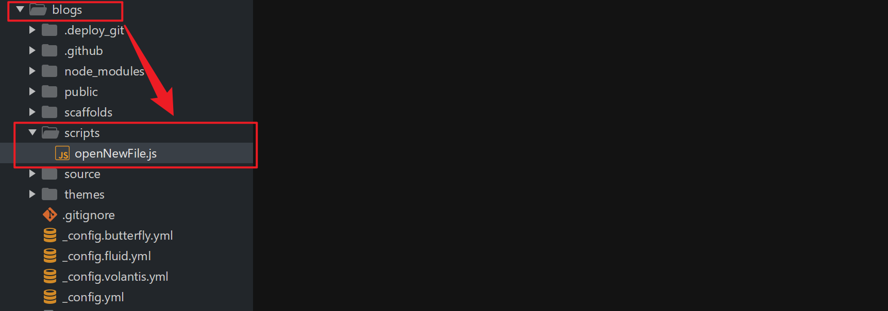

# hexo new执行后自动使用Typora打开MD源文件

## 1. hexo new执行后能够自动打开MD源文件

HEXO 的 GitHub 项目里，有人提出了类似的需求：[其解决方案](https://github.com/hexojs/hexo/issues/1007)

Tommy351 指出，可以在Hexo根目录下的 scripts 目录(若没有，则新建一个blogs/scripts)中创建一个名为`openNewFile`的JavaScript脚本，监听hexo new 这个动作。在检测到 hexo new 之后，执行编辑器打开的命令，blogs/scripts目录结构如下：



Tommy351 给出的js代码如下：

```js
var spawn = require('child_process').spawn;
// Hexo 2.x
hexo.on('new', function(path){
  spawn('vi', [path]);
});
// Hexo 3
hexo.on('new', function(data){
  spawn('vi', [data.path]);
});
// # 其中vi要替换为你的文本编辑器的绝对路径
```

整理后的js代码如下：

```js
var spawn = require('child_process').spawn;
// Hexo 2.x
hexo.on('new', function(path){
  spawn('vi', [path]);
});
```

```js
var spawn = require('child_process').spawn;
// Hexo 3
hexo.on('new', function(data){
  spawn('vi', [data.path]);
});
```

```js
var spawn = require('child_process').spawn;hexo.on('new', function(path){  spawn('vi', [path]);});
# Hexo 2.x 版本号
# 其中vi要替换为你的文本编辑器的绝对路径
```

```js
var spawn = require('child_process').spawn;hexo.on('new', function(data){  spawn('vi', [data.path]);});
# Hexo 3.x 版本号
# 其中vi要替换为你的文本编辑器的绝对路径
```

## 2. hexo new新建MD源文件测试

其中，blogs/scripts目录下openNewFile.js中的代码(这里使用hexo 3以后的版本)如下：

```js
var spawn = require('child_process').spawn;hexo.on('new', function(data){    spawn('D:/Program Files/Typora/Typora.exe ', [data.path]);}); 
或
var spawn = require('child_process').spawn;
// Hexo 3
hexo.on('new', function(data){
  spawn('D:/Program Files/Typora/Typora.exe', [data.path]);
});
```

此时在命令行新建博客文章：`hexo new 'hexo new执行后自动使用Typora打开MD源文件'`，会发现创建MD源文件之后就会自动使用Typora打开刚才新创建的博客MD源文件。
