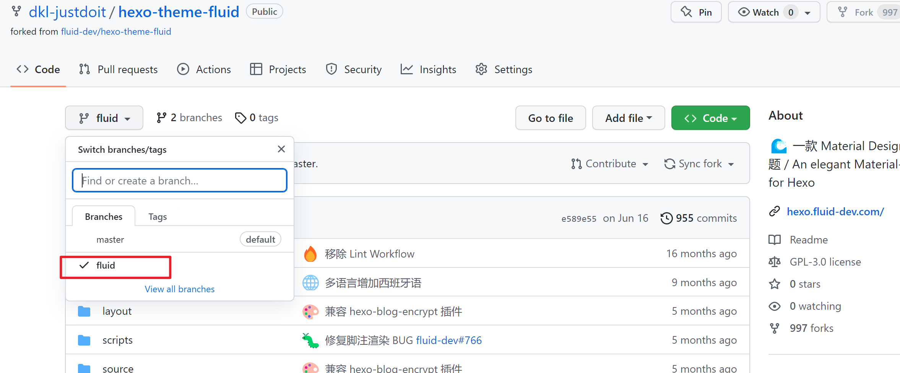

# hexo多主题共存(以fluid、volantis、butterfly为例)

## 1. 主题文件没有改动过的情况

由于主题都是直接clone原来的主题作者的，所以操作起来相对简单一些，这里以fluid主题为例。

### 1. 建立 fluid 主题子模块

考虑到在博客创建伊始，便在站点根目录下创建了blogs这个专门用来单独存放博客相关文件的文件夹，所以这里也以这种情况为例进行说明。

`git submodule add <主题的git地址> themes/<主题名字>`

需要注意的是：此时的`主题的git地址`和`主题文件改动过的情况`有着很大的区别

```bash
切换到blogs目录下
git submodule add git@github.com:fluid-dev/hexo-theme-fluid.git themes/hexo-theme-fluid # 这里的fluid主题仓库是原作者的
```

添加完之后 会在主git目录下面生成一个.gitmoudles文件(blogs目录外，与blogs目录同级)

### 2. 获得主题 fluid 文件

在本地站点建立了fluid主题子模块后，主题文件并不会自动clone到对应的目录，想要clone到本地，还需要在博客的主题目录的上一级目录blogs目录中执行

```bash
git submodule update --init --recursive # 拉取子模块并初始化本配置文件
```

此时主题就会下载到对应的目录，以fluid为例，就是下载到blogs/themes/hexo-theme-fluid/文件夹中。

### 3. 更新主题 fluid 文件

这样下次更新主题文件就直接在blogs文件夹中执行更新命令即可

```bash
git submodule update
```

### 4. 备份 fluid 主题的配置文件

考虑到该主题不可能只用一次，所以需要将主题的配置文件进行备份，尤其是在已经修改过配置，适配自己博客的情况下。由于除了必要的改动，几乎没有改动配置文件的其他地方，因此只需备份fluid的主题配置文件即可，其路径：`D:\BLOGS\blogs\themes\hexo-theme-fluid\_config.yml`。

### 5. 删除与 fluid 主题相关的文件及配置

删除任何文件之前，都需要搞清楚一件事，这个文件/文件夹在下载或者更新的时候，都产生了哪些文件/文件夹，只有知道了产生了哪些东西，才能知道我们要删除哪些东西。以fluid为例，主要是删除blogs/themes/hexo-theme-fluid/这个文件夹，除此之外，还要删除.gitmodules文件中与fluid对应的信息。

### 6. 恢复主题 fluid 文件

把第1、2、3步走一遍，然后将主题文件夹中主题配置文件替换成备份的fluid主题配置文件即可。

## 2. 主题文件DIY过的情况

前面的主题配置文件几乎没有更改过，思路理顺以后，下面这个更改过的主题配置文件会更简单，因为思路是相同的，只不过是配置起来麻烦些，这里仍以fluid主题为例。

### 1. fork 喜欢的主题源代码并建立 fluid 主题子模块

考虑到在博客创建伊始，便在站点根目录下创建了blogs这个专门用来单独存放博客相关文件的文件夹，所以这里同样以这种情况为例进行说明。

另外，在本地仓库中建立fluid主题子模块之前，需要登录github账号，打开`git@github.com:fluid-dev/hexo-theme-fluid.git`原作者的仓库页面，点击fork，复制一份主题源文件到自己仓库并取相同的名称`hexo-theme-fluid`，因为下面的操作都是在自己仓库中进行的，这样自己对该主题配置文件的修改才能保存到github，且主题原作者更新主题后，还能在自己仓库中与更新后的主题进行合并。

`git submodule add <自己fork的主题仓库的git地址> themes/<主题名字>`

需要注意的是：此时的`主题的git地址`和`主题文件没有改动过的情况`有着很大的区别

```bash
切换到blogs目录下
git submodule add git@github.com:dkl-justdoit/hexo-theme-fluid.git themes/hexo-theme-fluid # 这里的fluid主题仓库是自己的主题仓库，fork原作者的
```

添加完之后 会在主git目录下面生成一个.gitmoudles文件(blogs目录外，与blogs目录同级)

### 2. 获得主题 fluid 文件并推送更改后的主题文件到远端仓库的指定分支

在本地站点建立了fluid主题子模块后，主题文件并不会自动clone到对应的目录，想要clone到本地，还需要在博客的主题目录的上一级目录blogs目录中执行

```bash
切换到blog目录下
git submodule update --init --recursive # 拉取子模块并初始化本配置文件
```

此时主题就会下载到对应的目录，以fluid为例，就是下载到blogs/themes/hexo-theme-fluid/文件夹中，然后就可以依据自己的喜好来修改主题配置文件。

修改完成后，下面将切换到主题fluid文件夹内，将所有fluid的主题文件通过git工具推送到远端仓库`hexo-theme-fluid`的`fluid分支`。

```bash
cd themes/hexo-theme-fluid/ # 进入主题文件目录

git branch fluid    # 创建本地fluid主题分支
git checkout fluid  # 切换到fluid本地主题分支
git add .
git commit -m '剥离主题fluid'
git push -u ssh_origin fluid # 推送本地fluid主题分支到dkl-justdoit/hexo-theme-fluid.git/fluid分支，并进行关联追踪
# 然后在自己的分支上面跟随原主题作者的更新 处理合并 生成的时候直接pull到本地就行
```

下面可以通过两方面来进行验证，一方面是hexo博客，因为它使用了fluid主题；另一方面是`git@github.com:dkl-justdoit/hexo-theme-fluid.git`，因为将修改过后的所有fluid主题文件都推送到了`dkl-justdoit/hexo-theme-fluid.git/fluid分支`上。

```bash
切换到blog目录下
hexo clean
hexo g
hexo d
hexo s
```



### 3. 更新主题 fluid 文件

这样下次更新主题文件就直接在blogs文件夹中执行更新命令即可

```bash
git submodule update(需要测试)
又或
git pull ssh_origin fluid(需要测试)
```

### 4. 备份 fluid 主题的配置文件

考虑到该主题不可能只用一次，所以需要将主题的配置文件进行备份，尤其是在已经修改过配置，适配自己博客的情况下。首先就需要备份fluid的主题配置文件，其路径：`D:\BLOGS\blogs\themes\hexo-theme-fluid\_config.yml`。至于主题的其他配置，还需要单独处理。

### 5. 删除与 fluid 主题相关的文件及配置

删除任何文件之前，都需要搞清楚一件事，这个文件/文件夹在下载或者更新的时候，都产生了哪些文件/文件夹，只有知道了产生了哪些东西，才能知道我们要删除哪些东西。以fluid为例，主要是删除blogs/themes/hexo-theme-fluid/这个文件夹，除此之外，还要删除.gitmodules文件中与fluid对应的信息。

### 6. 恢复主题 fluid 文件

把上面的 1、2、3 步走一遍，然后将主题文件夹中主题配置文件替换成备份的fluid主题配置文件即可。

## 3. 这样做的好处

1. 主题设置跟站点设置分离，主题本身就是模块化的，方便维护。
2. 可以设置多个主题，想用哪个用哪个，一套主题对应一套主题配置文件。
3. 可以随便、随时、随地换主题，只需要更改站点配置里面的主题名字即可。
4. 方便在多台电脑上同步，当然也方便换电脑。

### 真的换电脑了

这个需要简单几步即可，换新电脑后想同步博客简化操作：

```bash
1、完成git安装;
2、完成nodejs安装和环境配置;
3、npm install hexo-cli -g  # 先使用npm工具全局安装hexo-cli，最好使用cmd(管理员)执行该命令;
4、git clone -b hexo-source git@github.com:dkl-justdoit/dkl-justdoit.github.io.git # 通过-b参数可以自行指定要拉取远程库的哪个分支；通过这种方式在本地创建该分支的文件夹，且只包含该远程仓库的该分支下所有文件，其他分支文件不会包含；而且克隆后本地只有这一个分支。
5、进入dkl-justdoit.github.io文件夹,右键git bash,输入npm install;
6、若dkl-justdoit.github.io中有blogs文件夹,则切换到blogs目录后执行git submodule update --init --recursive;若dkl-justdoit.github.io中没有blogs文件夹,则直接执行git submodule update --init --recursive即可。
7、打完,收工!开始写博客。
```

>参考：https://www.cnblogs.com/daoyi/p/hexo-duo-zhu-ti-qie-huan.html

