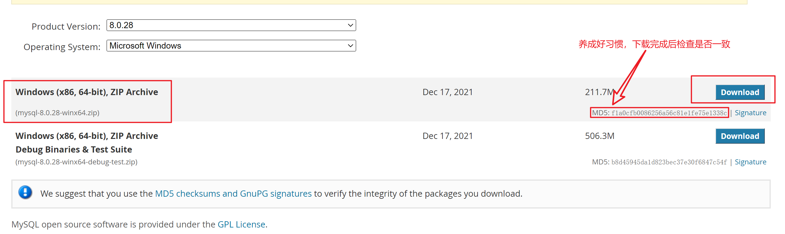
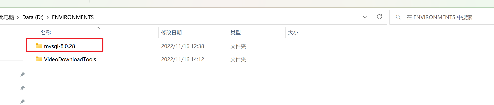
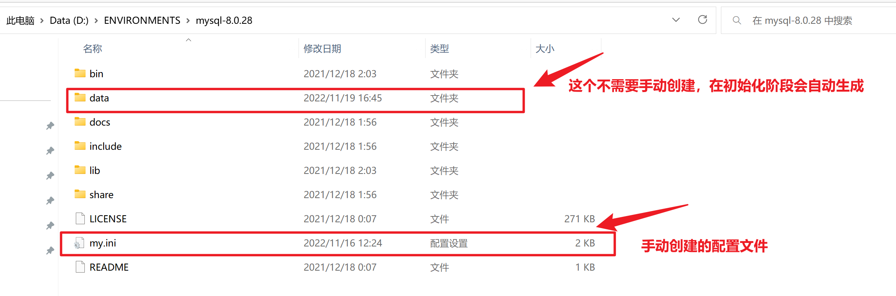
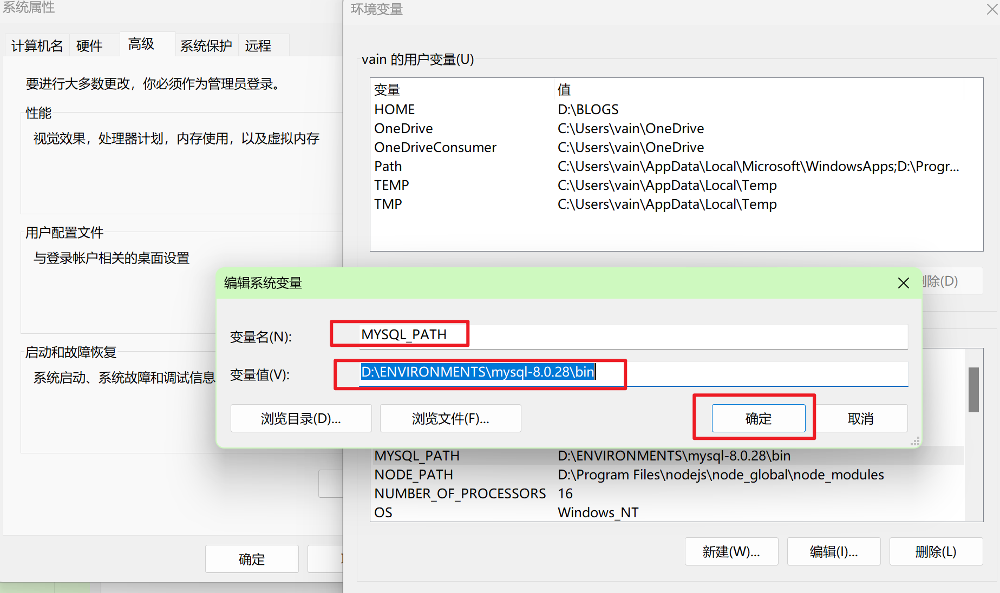

# mysql8.0及以上数据库安装过程[windows]

## 1、官网下载安装包

https://downloads.mysql.com/archives/community/



## 2、解压安装包到本地磁盘





`注意：这里需要创建my.ini配置文件，但是data文件夹不需要手工创建，因为在下面会自动创建data文件夹。`

## 3、创建my.ini配置文件

- 编码格式为UTF-8，不是UTF-8 with BOM

## 4、配置my.ini文件，修改指定位置内容

- 重点关注三个参数：basedir、lc-messages-dir、datadir
- 把`D:\\ENVIRONMENTS\\mysql-8.0.28`替换为`mysql中bin的上一级目录`

```ini
[mysqld]
# 必看说明：！！！
# 1. 此代码中所有#开头的句子都可以删除
# 2. 此代码中全部使用双\\，以防转义字符出现问题
# 设置 3306 端口
port=3306
# 设置 mysql 的安装目录
basedir=D:\\ENVIRONMENTS\\mysql-8.0.28
# 设置错误信息存放目录，一定注意找到对应的"english"文件夹！！
lc-messages-dir=D:\\ENVIRONMENTS\\mysql-8.0.28\\share\\english
# 设置 mysql 数据库的数据的存放目录
datadir=D:\\ENVIRONMENTS\\mysql-8.0.28\\data
# 允许最大连接数
max_connections=200
# 允许连接失败的次数。这是为了防止有人从该主机试图攻击数据库系统
max_connect_errors=10
# 服务端使用的字符集默认为 UTF8
character-set-server=utf8
# 创建新表时将使用的默认存储引擎
default-storage-engine=INNODB
# 默认使用“mysql_native_password”插件认证
default_authentication_plugin=mysql_native_password
[mysql]
# 设置 mysql 客户端默认字符集
default-character-set=utf8
[client]
# 设置 mysql 客户端连接服务端时默认使用的端口
port=3306
default-character-set=utf8
#[WinMySQLAdmin]
#Server=D:\ENVIRONMENTS\mysql-8.0.28\bin\mysqld.exe
#设置将mysql的服务添加到注册表中，反正我当时没加这句话初始化有问题，目录照猫画虎，单双杠自己选
#关于3306端口没什么好说的，MySQL默认端口可能会被占用，修改端口即可。
```

## 5、配置环境变量

- `把mysql的bin目录加到环境变量-->系统变量的path路径中`
- `在系统变量中新建：变量名为MYSQL_PATH；变量值为D:\ENVIRONMENTS\mysql-8.0.28\bin`
- `在系统变量的path变量中，新建：%MYSQL_PATH%`
- 完成后依次确定即可



## 6、初始化mysql环境配置

- 输入cmd，以管理员身份运行

- ```mysql
  依次输入以下命令：
  mysqld --initialize-insecure #创建data文件夹
  mysqld --defaults-file=D:\ENVIRONMENTS\mysql-8.0.28\my.ini --initialize -console #初始化(这里的路径改成自己的安装路径)
  mysqld install #安装服务，正确会显示“Service successfully installed.”
  mysqld --initialize-insecure --user=mysql #创建root用户
  net start mysql #启动服务，会显示“mysql服务正在启动.”，启动成功会显示“mysql服务已经启动成功。”
  mysqladmin -u root -p password 123456 #设置root账号的密码，回车后可以直接回车，因为默认root账号密码为空，所以虽然修改密码需要密码，但是可以直接回车校验，因为默认密码为空(密码可改可不改)
  mysql -u root -p #验证账户，回车后输入前面修改的root密码即可，然后回车看到welcome欢迎信息即证明登录成功。
  # 通过以上操作，就得到了一组管理员账号和密码，管理员账号是root，对应的管理员密码是123456
  ```

