# 下载并安装Emeditor文本编辑器

1. 下载地址：https://www.emeditor.com/#download

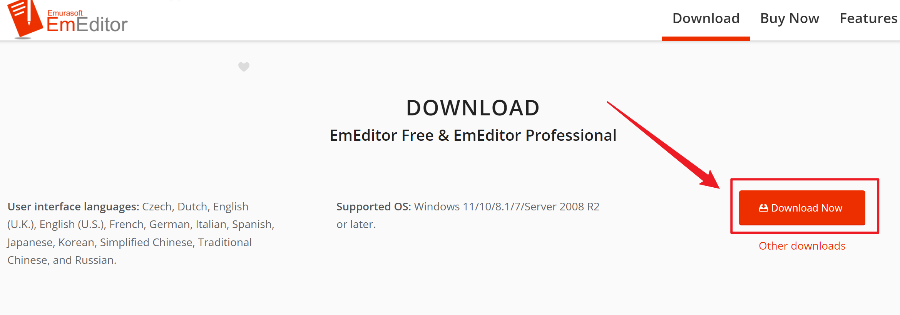

2. 下载完成后双击Emeditor安装包，然后点击下一步

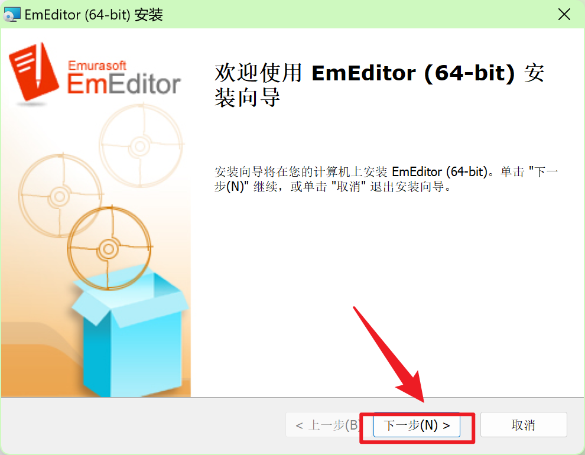

3. 选择安装类型，不能选择，只能保持默认，点击下一步

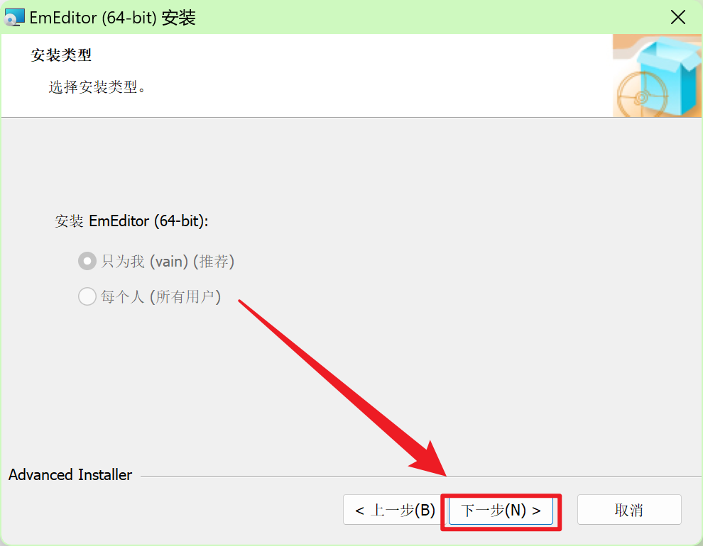

4. 接受许可，点击下一步

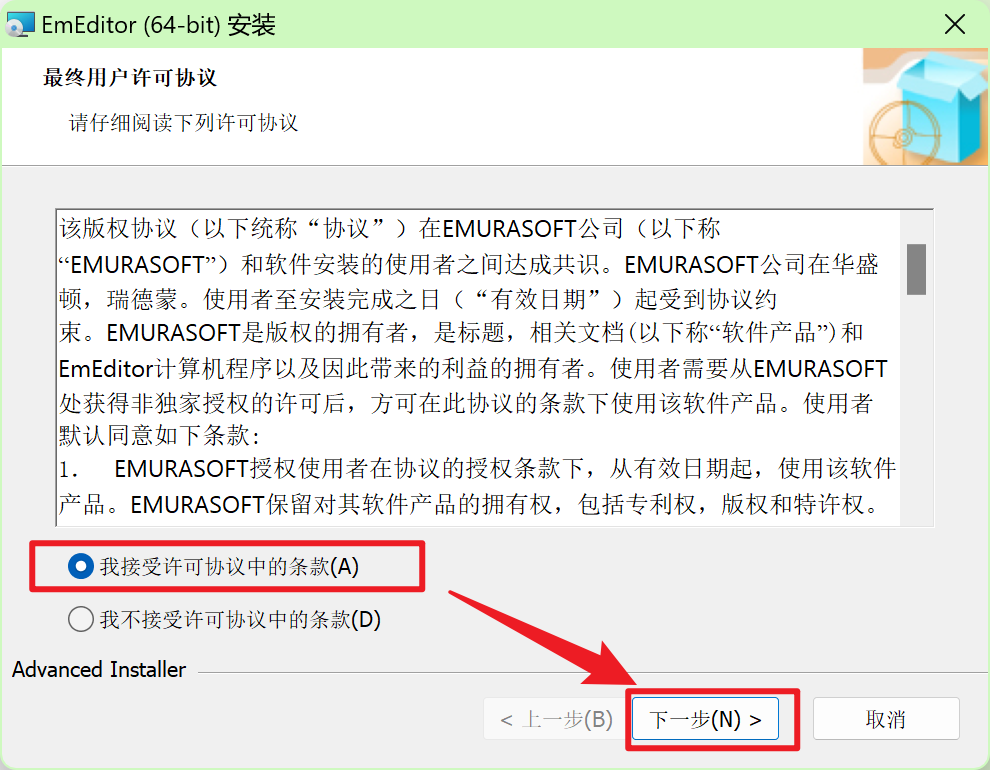

5. 选择安装类型：自定义安装

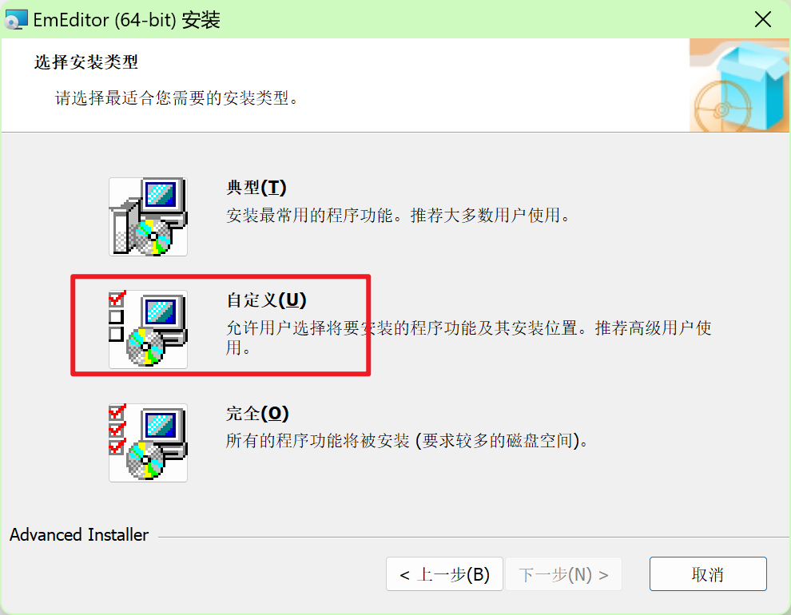

6. 点击程序菜单快捷方式和文件关联，点击下一步

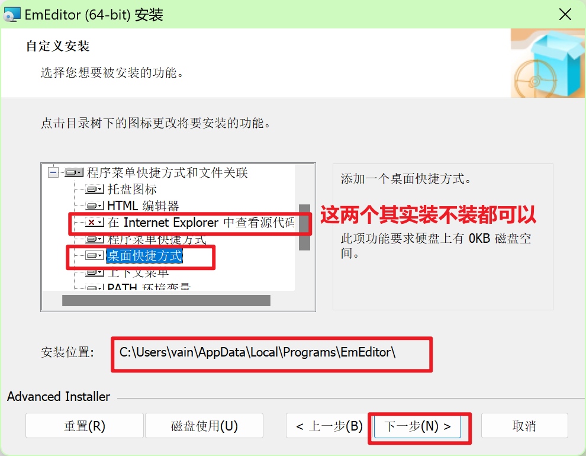

7. 点击安装，等待安装完成

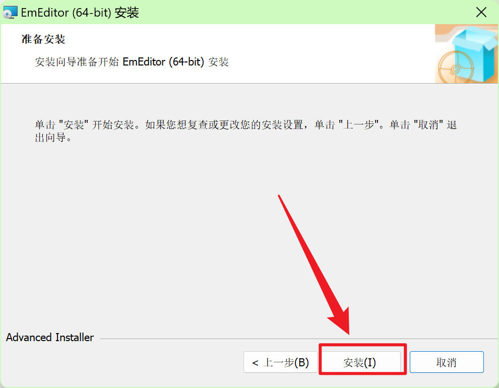

8. 点击完成，启动Emeditor文本编辑器

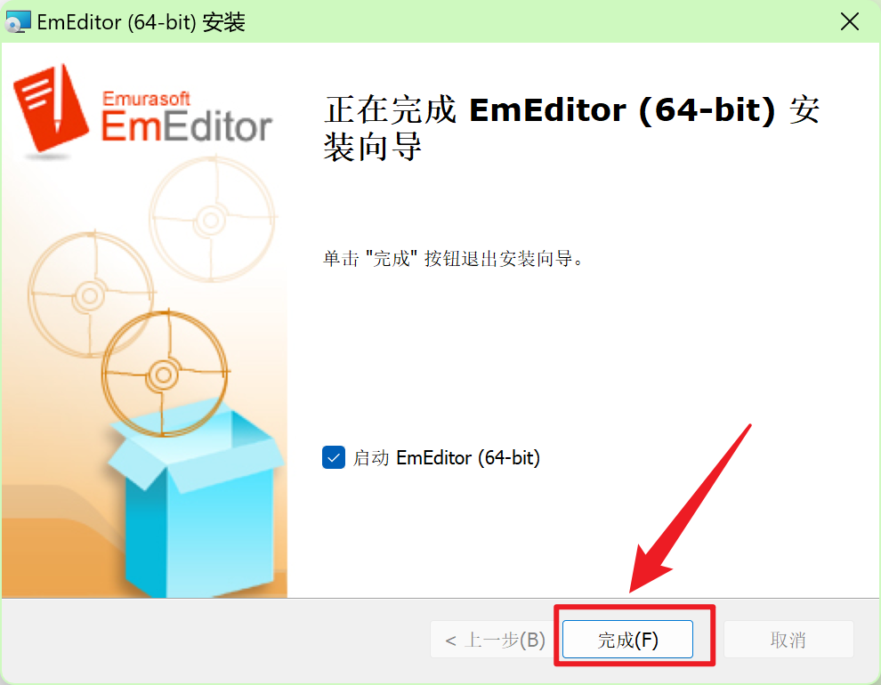

9. 点击"使用EmEditor Professional"，输入注册码

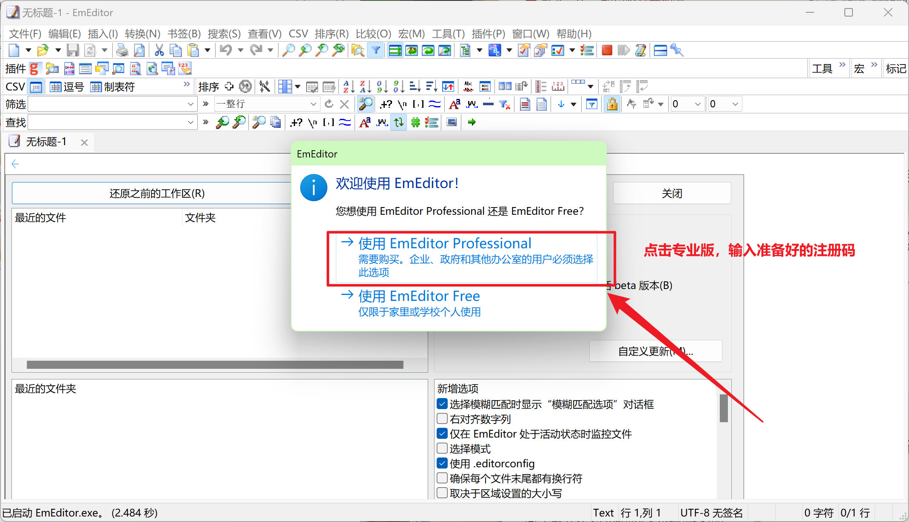

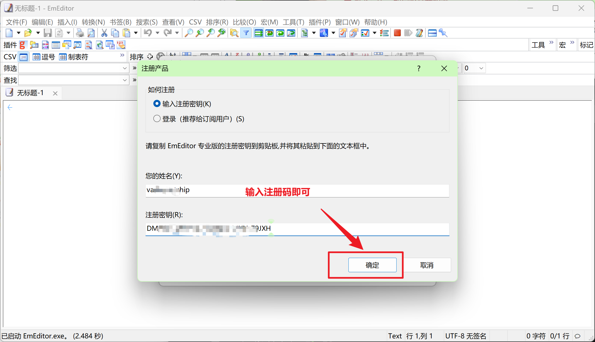

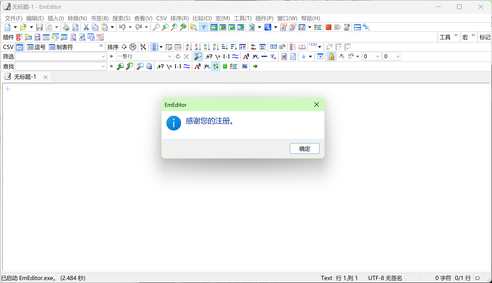
