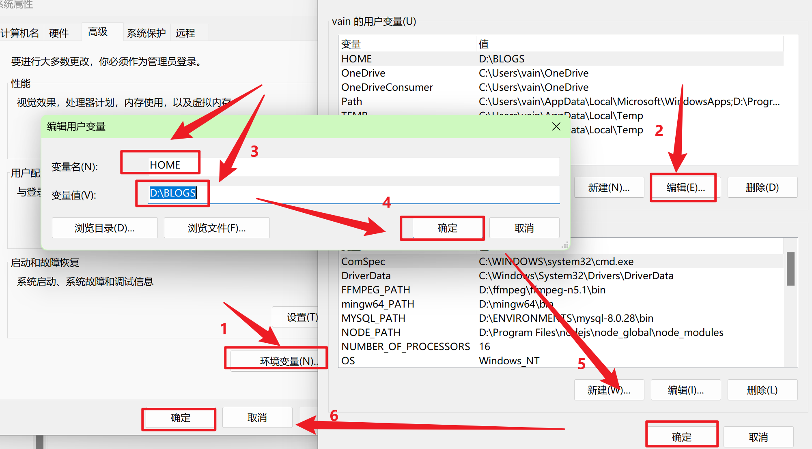

# 修改Git的默认家目录

前提条件：Git已经安装

## 如何修改git的默认家目录

1. 首先查看未修改前的Git默认家目录，以我这台电脑为例，右键打开git bash后操作如下：

```bash
vain@XXX-BF MINGW64 /c/Users/vain/Desktop
$ cd     # cd和cd ~作用是相同的
vain@XXX-BF MINGW64 ~ (hexo-source)
$ pwd
/c/Users/vain
vain@XXX-BF MINGW64 ~ (hexo-source)
$
```

2. 在环境变量的用户变量中，添加一个变量，变量名：`HOME`;变量值：`D:\BLOGS`。



3. 验证修改后的Git默认家目录。

```bash
vain@XXX-BF MINGW64 /c/Users/vain/Desktop
$ cd
vain@XXX-BF MINGW64 ~ (hexo-source)
$ pwd
/d/BLOGS
vain@XXX-BF MINGW64 ~ (hexo-source)
$
```

4. 当然如果想要打开其他路径，也是可以的，打开对应路径的文件夹，在文件夹中右键git bash即可。
